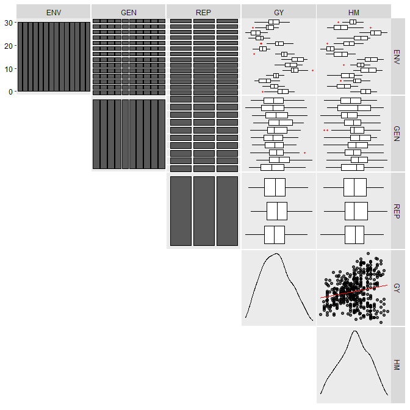
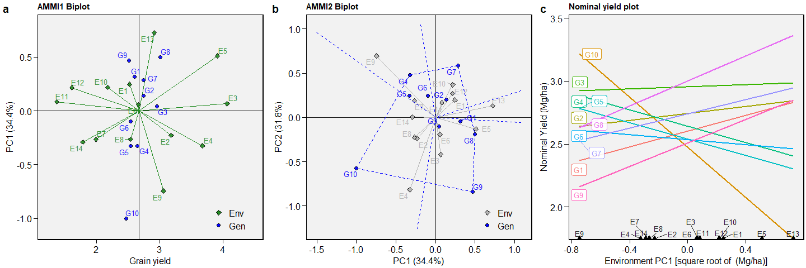
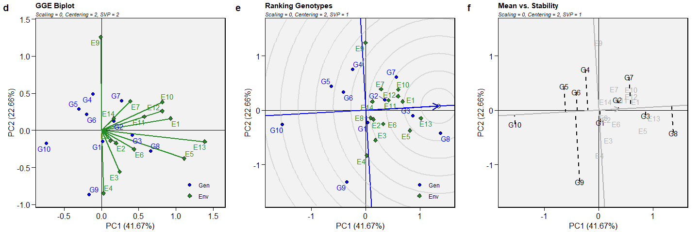
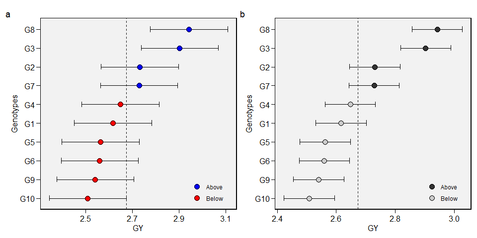

<!-- README.md is generated from README.Rmd. Please edit that file -->

# metan 

<!-- badges: start -->

[](https://CRAN.R-project.org/package=metan)
[](https://www.tidyverse.org/lifecycle/#stable)
[](https://CRAN.R-project.org/package=metan)
[](https://cran.r-project.org/package=metan)
[](https://doi.org/10.5281/zenodo.3837359)

<!-- badges: end -->

`metan` (**m**ulti-**e**nvironment **t**rials **an**alysis) provides
useful functions for analyzing multi-environment trial data using
parametric and nonparametric methods. The package will help you to:

  - Inspect data for possible common errors;
  - Manipulate rows and columns;
  - Manipulate numbers and strings;
  - Compute descriptive statistics;
  - Compute within-environment analysis of variance;
  - Compute AMMI analysis with prediction considering different numbers
    of interaction principal component axes;
  - Compute AMMI-based stability indexes;
  - Compute GGE biplot analysis;
  - Compute BLUP-based stability indexes;
  - Compute variance components and genetic parameters in mixed-effect
    models;
  - Perform cross-validation procedures for AMMI-family and BLUP models;
  - Compute parametric and nonparametric stability statistics
  - Implement biometrical models

For more details see the [complete
vignette](https://tiagoolivoto.github.io/metan/).

# Installation

Install the released version of metan from
[CRAN](https://CRAN.R-project.org/package=metan) with:

``` r
install.packages("metan")
```

Or install the development version from
[GitHub](https://github.com/TiagoOlivoto/metan) with:

``` r
devtools::install_github("TiagoOlivoto/metan")

# To build the HTML vignette use
devtools::install_github("TiagoOlivoto/metan", build_vignettes = TRUE)
```

*Note*: If you are a Windows user, you should also first download and
install the latest version of
[Rtools](https://cran.r-project.org/bin/windows/Rtools/).

For the latest release notes on this development version, see the [NEWS
file](https://tiagoolivoto.github.io/metan/news/index.html).

## Cheatsheet

<a href="https://github.com/TiagoOlivoto/metan/raw/master/metan_cheat_sheet.pdf"></a>

# Getting started

`metan` offers a set of functions that can be used to manipulate,
summarize, analyze and plot typical multi-environment trial data. Maybe,
one of the first functions users should use would be
[`inspect()`](https://tiagoolivoto.github.io/metan/reference/inspect.html).
Here, we will inspect the example dataset `data_ge` that contains data
on two variables assessed in 10 genotypes growing in 14 environments.

``` r
library(metan)

inspect(data_ge, plot = TRUE)
# # A tibble: 5 x 9
#   Variable Class   Missing Levels Valid_n   Min Median   Max Outlier
#   <chr>    <chr>   <chr>   <chr>    <int> <dbl>  <dbl> <dbl>   <dbl>
# 1 ENV      factor  No      14         420 NA     NA    NA         NA
# 2 GEN      factor  No      10         420 NA     NA    NA         NA
# 3 REP      factor  No      3          420 NA     NA    NA         NA
# 4 GY       numeric No      -          420  0.67   2.61  5.09       0
# 5 HM       numeric No      -          420 38     48    58          0
```



No issues while inspecting the data. If any issue is given here (like
outliers, missing values, etc.) consider using
[`find_outliers()`](https://tiagoolivoto.github.io/metan/reference/find_outliers.html)
to find possible outliers in the data set or any `metan`’s data
manipulation tool such as
[`remove_na_rows()`](https://tiagoolivoto.github.io/metan/reference/utils_na.html)
to remove rows with `NA` values,
[`to_factor()`](https://tiagoolivoto.github.io/metan/reference/to_factor.html)
to convert desired columns to factor,
[`find_text_in_num()`](https://tiagoolivoto.github.io/metan/reference/utils_num_str.html)
to find text fragments in columns assumed to be numeric, or even
[`tidy_strings()`](https://tiagoolivoto.github.io/metan/reference/utils_num_str.html)
to tidy up strings.

# Descriptive statistics

`metan` provides [a set of
functions](https://tiagoolivoto.github.io/metan/reference/utils_stats.html)
to compute descriptive statistics. The easiest way to do that is by
using
[`desc_stat()`](https://tiagoolivoto.github.io/metan/reference/desc_stat.html).

``` r
desc_stat(data_ge2)
# # A tibble: 15 x 9
#    variable    cv     max    mean  median     min  sd.amo     se      ci
#    <chr>    <dbl>   <dbl>   <dbl>   <dbl>   <dbl>   <dbl>  <dbl>   <dbl>
#  1 CD        7.34  18.6    16.0    16      12.9    1.17   0.0939  0.186 
#  2 CDED      5.71   0.694   0.586   0.588   0.495  0.0334 0.0027  0.0053
#  3 CL        7.95  34.7    29.0    28.7    23.5    2.31   0.185   0.365 
#  4 CW       25.2   38.5    24.8    24.5    11.1    6.26   0.501   0.99  
#  5 ED        5.58  54.9    49.5    49.9    43.5    2.76   0.221   0.437 
#  6 EH       21.2    1.88    1.34    1.41    0.752  0.284  0.0228  0.045 
#  7 EL        8.28  17.9    15.2    15.1    11.5    1.26   0.101   0.199 
#  8 EP       10.5    0.660   0.537   0.544   0.386  0.0564 0.0045  0.0089
#  9 KW       18.9  251.    173.    175.    106.    32.8    2.62    5.18  
# 10 NKE      14.2  697.    512.    509.    332.    72.6    5.82   11.5   
# 11 NKR      10.7   42      32.2    32      23.2    3.47   0.277   0.548 
# 12 NR       10.2   21.2    16.1    16      12.4    1.64   0.131   0.259 
# 13 PERK      2.17  91.8    87.4    87.5    81.2    1.90   0.152   0.300 
# 14 PH       13.4    3.04    2.48    2.52    1.71   0.334  0.0267  0.0528
# 15 TKW      13.9  452.    339.    342.    218.    47.1    3.77    7.44
```

# AMMI model

## Fitting the model

The AMMI model is fitted with the function
[`performs_ammi()`](https://tiagoolivoto.github.io/metan/reference/performs_ammi.html).
To analyze multiple variables at once we can use a comma-separated
vector of unquoted variable names, or use any select helper in the
argument `resp`. Here, using `everything()` we apply the function to all
numeric variables in the data. For more details, see the [complete
vignette](https://tiagoolivoto.github.io/metan/articles/vignettes_ammi.html).

``` r
model <- performs_ammi(data_ge,
                       env = ENV,
                       gen = GEN,
                       rep = REP,
                       resp = everything(),
                       verbose = FALSE)
# Significance of IPCAs
get_model_data(model, "ipca_pval")
# Class of the model: performs_ammi
# Variable extracted: Pr(>F)
# # A tibble: 9 x 4
#   PC       DF      GY     HM
#   <chr> <dbl>   <dbl>  <dbl>
# 1 PC1      21 0       0     
# 2 PC2      19 0       0     
# 3 PC3      17 0.0014  0.0021
# 4 PC4      15 0.00960 0.0218
# 5 PC5      13 0.318   0.0377
# 6 PC6      11 0.561   0.041 
# 7 PC7       9 0.754   0.0633
# 8 PC8       7 0.804   0.232 
# 9 PC9       5 0.934   0.944
```

## Biplots

The well-known AMMI1 and AMMI2 biplots can be created with
[`plot_scores()`](file:///D:/Desktop/metan/docs/reference/plot_scores.html).
Note that since
[`performs_ammi`](https://tiagoolivoto.github.io/metan/reference/performs_ammi.html)
allows analyzing multiple variables at once, e.g., `resp = c(v1, v2,
...)`, the output `model` is a list, in this case with two elements (GY
and HM). By default, the biplots are created for the first variable of
the model. To choose another variable use the argument `var` (e.g., `var
= "HM"`).

``` r
a <- plot_scores(model)
b <- plot_scores(model,
                 type = 2,
                 polygon = TRUE,
                 col.env = "gray70",
                 col.segm.env = "gray70",
                 axis.expand = 1.5)
c <- plot_scores(model, type = 4)
arrange_ggplot(a, b, c, labels = letters[1:3], nrow = 1)
```

<!-- -->

# GGE model

The GGE model is fitted with the function
[`gge()`](https://tiagoolivoto.github.io/metan/reference/gge.html). For
more details, see the [complete
vignette](https://tiagoolivoto.github.io/metan/articles/vignettes_gge.html).

``` r
model <- gge(data_ge, ENV, GEN, GY)
model2 <- gge(data_ge, ENV, GEN, GY, svp = "genotype")
model3 <- gge(data_ge, ENV, GEN, GY, svp = "symmetrical")
d <- plot(model)
e <- plot(model2, type = 8)
f <- plot(model2,
          type = 2,
          col.gen = "black",
          col.env = "gray70",
          axis.expand = 1.5)
arrange_ggplot(d, e, f, labels = letters[4:6], nrow = 1)
```

<!-- -->

# BLUP model

Linear-mixed effect models to predict the response variable in METs are
fitted using the function
[`waasb()`](https://tiagoolivoto.github.io/metan/reference/waasb.html).
Here we will obtain the predicted means for genotypes in the variables
`GY` and `HM`. For more details, see the [complete
vignette](https://tiagoolivoto.github.io/metan/articles/vignettes_blup.html).

``` r
model2 <- waasb(data_ge,
                env = ENV,
                gen = GEN,
                rep = REP,
                resp = everything())
# Method: REML/BLUP
# Random effects: GEN, GEN:ENV
# Fixed effects: ENV, REP(ENV)
# Denominador DF: Satterthwaite's method
# ---------------------------------------------------------------------------
# P-values for Likelihood Ratio Test of the analyzed traits
# ---------------------------------------------------------------------------
#     model       GY       HM
#  COMPLETE       NA       NA
#       GEN 1.11e-05 5.07e-03
#   GEN:ENV 2.15e-11 2.27e-15
# ---------------------------------------------------------------------------
# All variables with significant (p < 0.05) genotype-vs-environment interaction
# Get the variance components
get_model_data(model2, what = "vcomp")
# Class of the model: waasb
# Variable extracted: vcomp
# # A tibble: 3 x 3
#   Group        GY    HM
#   <chr>     <dbl> <dbl>
# 1 GEN      0.0280 0.490
# 2 GEN:ENV  0.0567 2.19 
# 3 Residual 0.0967 2.84
```

## Plotting the BLUPs for genotypes

To produce a plot with the predicted means, use the function
[`plot_blup()`](https://tiagoolivoto.github.io/metan/reference/plot_blup.html).

``` r
g <- plot_blup(model2)
h <- plot_blup(model2,
               prob = 0.1,
               col.shape  =  c("gray20", "gray80")) + ggplot2::coord_flip()
arrange_ggplot(g, h, labels = letters[7:8])
```

<!-- -->

# Computing parametric and non-parametric stability indexes

The easiest way to compute parametric and non-parametric stability
indexes in `metan` is by using the function
[`ge_stats()`](https://tiagoolivoto.github.io/metan/reference/ge_stats.html).
It is a wrapper function around a lot of specific functions for
stability indexes. To get the results into a *“ready-to-read”* file, use
[get\_model\_data()](https://tiagoolivoto.github.io/metan/reference/get_model_data.html)
or its shortcut
[`gmd()`](https://tiagoolivoto.github.io/metan/reference/get_model_data.html).

``` r
stats <- ge_stats(data_ge, ENV, GEN, REP, GY)
get_model_data(stats)
# Class of the model: ge_stats
# Variable extracted: stats
# # A tibble: 10 x 33
#    var   gen       Y    CV   Var Shukla  Wi_g  Wi_f  Wi_u Ecoval   bij      Sij
#    <chr> <chr> <dbl> <dbl> <dbl>  <dbl> <dbl> <dbl> <dbl>  <dbl> <dbl>    <dbl>
#  1 GY    G1     2.60  35.2 10.9  0.0280  84.4  89.2  81.1  1.22  1.06  -0.00142
#  2 GY    G10    2.47  42.3 14.2  0.244   59.2  64.6  54.4  7.96  1.12   0.177  
#  3 GY    G2     2.74  34.0 11.3  0.0861  82.8  95.3  75.6  3.03  1.05   0.0497 
#  4 GY    G3     2.96  29.9 10.1  0.0121 104.   99.7 107.   0.725 1.03  -0.0128 
#  5 GY    G4     2.64  31.4  8.93 0.0640  85.9  79.5  91.9  2.34  0.937  0.0298 
#  6 GY    G5     2.54  30.6  7.82 0.0480  82.7  82.2  82.4  1.84  0.887  0.00902
#  7 GY    G6     2.53  29.7  7.34 0.0468  83.0  83.7  81.8  1.81  0.861  0.00304
#  8 GY    G7     2.74  27.4  7.33 0.122   83.9  77.6  93.4  4.16  0.819  0.0579 
#  9 GY    G8     3.00  30.4 10.8  0.0712  98.8  90.5 107.   2.57  1.03   0.0382 
# 10 GY    G9     2.51  42.4 14.7  0.167   68.8  68.9  70.3  5.56  1.19   0.0938 
# # ... with 21 more variables: R2 <dbl>, ASV <dbl>, SIPC <dbl>, EV <dbl>,
# #   ZA <dbl>, WAAS <dbl>, HMGV <dbl>, RPGV <dbl>, HMRPGV <dbl>, Pi_a <dbl>,
# #   Pi_f <dbl>, Pi_u <dbl>, Gai <dbl>, S1 <dbl>, S2 <dbl>, S3 <dbl>, S6 <dbl>,
# #   N1 <dbl>, N2 <dbl>, N3 <dbl>, N4 <dbl>
```

# Citation

``` r
citation("metan")

Please, support this project by citing it in your publications!

  Olivoto, T., and Lúcio, A.D. (2020). metan: an R package for
  multi-environment trial analysis. Methods Ecol Evol. Accepted Author
  Manuscript doi:10.1111/2041-210X.13384

A BibTeX entry for LaTeX users is

  @Article{Olivoto2020,
    author = {Tiago Olivoto and Alessandro Dal'Col L{'{u}}cio},
    title = {metan: an R package for multi-environment trial analysis},
    journal = {Methods in Ecology and Evolution},
    volume = {n/a},
    number = {n/a},
    year = {2020},
    doi = {10.1111/2041-210X.13384},
    url = {https://besjournals.onlinelibrary.wiley.com/doi/abs/10.1111/2041-210X.13384},
    eprint = {https://besjournals.onlinelibrary.wiley.com/doi/pdf/10.1111/2041-210X.13384},
  }
```

# Getting help

  - If you encounter a clear bug, please file a minimal reproducible
    example on [github](https://github.com/TiagoOlivoto/metan/issues)

  - Suggestions and criticisms to improve the quality and usability of
    the package are welcome\!
