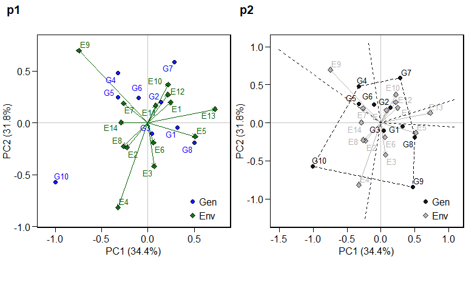
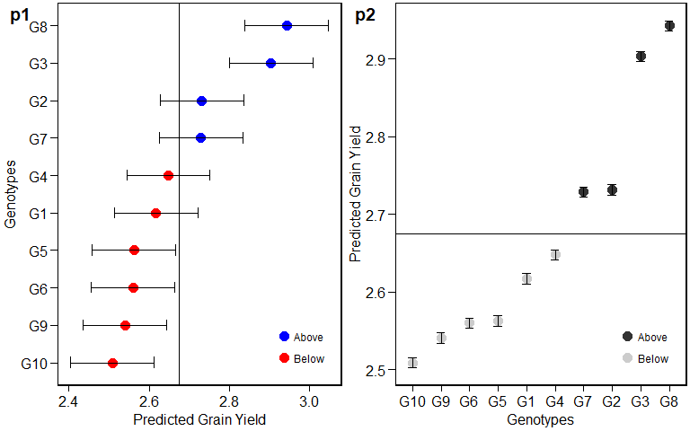

<!-- README.md is generated from README.Rmd. Please edit that file -->
METAAB 
=================================================================

The METAAB (**M**ulti-environment **T**rials **A**nalysis using **A**MMI and **B**LUP) package provides useful functions for analyzing multi-environment trial data using Additive Main Effects and Multiplicative Interaction (AMMI) and Best Linear Unbiased Prediction (BLUP) models. The main features include, but are not limited to:

-   Cross-validation procedures for AMMI-family and BLUP models;
-   Estimation AMMI models based on number of IPCAs;
-   Prediction in mixed-effect models;
-   Variance components and genetic parameters in mixed-effect models;
-   Graphics tools for generating biplots

Dependences
===========

METAAB depends on the following R packages.

-   `grid` for arranging plots
-   `ggplot2` for graphics
-   `ggrepel` for avoiding overlaps text in plots
-   `magrittr` for the %&gt;% opperator
-   `dendexted` and `gplots` for dendrograms
-   `dplyr` for data manipulation
-   `lme4` and `lmerTest` for mixed-effect models

Installing
==========

The latest development version can be download from GitHub by running

``` r
install.packages("devtools")
devtools::install_github("TiagoOlivoto/METAAB")
```

Brief examples
==============

The package `kableExtra` and `cowplot` were used to generate the tables and arranging the graphics of this material.

The `METAAB` contains some datasets for examples. We will use the example `data_ge` that contains data from two variables assessed in 10 genotypes growing in in 11 environments. For more details see `?data_ge`

``` r
library(METAAB)
str(data_ge)
```

    ## Classes 'tbl_df', 'tbl' and 'data.frame':    420 obs. of  5 variables:
    ##  $ ENV: Factor w/ 14 levels "E1","E10","E11",..: 1 1 1 1 1 1 1 1 1 1 ...
    ##  $ GEN: Factor w/ 10 levels "G1","G10","G2",..: 1 1 1 3 3 3 4 4 4 5 ...
    ##  $ REP: Factor w/ 3 levels "1","2","3": 1 2 3 1 2 3 1 2 3 1 ...
    ##  $ GY : num  2.17 2.5 2.43 3.21 2.93 ...
    ##  $ HM : num  44.9 46.9 47.8 45.2 45.3 ...

AMMI model
----------

### Fitting the model

The AMMI model is fitted with the function `WAAS.AMMI()`. For more details, please see `?WAAS.AMMI`.

``` r
model <- WAAS.AMMI(data_ge,
                  resp = GY,
                  gen = GEN,
                  env = ENV,
                  rep = REP)
```

    ## Done!

### Biplots

ggplot2-based graphics are easily obtained in METAAB package. For example, the well-known AMMI2 biplot may be obtained as follows. Please, note that since `WAAS.AMMI()` function allows analyzing multiple variables at the same time, e.g., resp = c(v1, v2, ...), the output `model` is a list, in this case with one element, GY.

``` r
library(cowplot)
p1 = plot.scores(model$GY)
p2 = plot.scores(model$GY,
                 type = 1,
                 polygon = TRUE,
                 col.gen = "black",
                 col.env = "gray70",
                 col.segm.env = "gray70",
                 axis.expand = 1.5)
plot_grid(p1, p2, labels = c("p1","p2"))
```



### S3 method `predict()`

The S3 method `predict()` is implemented for objects of class `WAAS.AMMI` and may be used to estimate the response of each genotype in each environment considering different number of Interaction Principal Component Axis (IPCA). For example, we will use four IPCA (number of significant IPCAs) to estimate the variable GY using the `model` object.

``` r
library(kableExtra)
predicted = predict(model, naxis = 4)
predicted = predicted$GY[1:5,]
kable(predicted, "html") %>%
  kable_styling(bootstrap_options = "striped", "condensed", full_width = F)
```

<table class="table table-striped" style="width: auto !important; margin-left: auto; margin-right: auto;">
<thead>
<tr>
<th style="text-align:left;">
ENV
</th>
<th style="text-align:left;">
GEN
</th>
<th style="text-align:right;">
Y
</th>
<th style="text-align:right;">
resOLS
</th>
<th style="text-align:right;">
Ypred
</th>
<th style="text-align:right;">
ResAMMI
</th>
<th style="text-align:right;">
YpredAMMI
</th>
<th style="text-align:right;">
AMMI0
</th>
</tr>
</thead>
<tbody>
<tr>
<td style="text-align:left;">
E1
</td>
<td style="text-align:left;">
G1
</td>
<td style="text-align:right;">
2.365787
</td>
<td style="text-align:right;">
-0.0843311
</td>
<td style="text-align:right;">
2.450118
</td>
<td style="text-align:right;">
0.07115484
</td>
<td style="text-align:right;">
2.521273
</td>
<td style="text-align:right;">
2.450118
</td>
</tr>
<tr>
<td style="text-align:left;">
E1
</td>
<td style="text-align:left;">
G10
</td>
<td style="text-align:right;">
1.974073
</td>
<td style="text-align:right;">
-0.3435891
</td>
<td style="text-align:right;">
2.317662
</td>
<td style="text-align:right;">
-0.35391141
</td>
<td style="text-align:right;">
1.963751
</td>
<td style="text-align:right;">
2.317662
</td>
</tr>
<tr>
<td style="text-align:left;">
E1
</td>
<td style="text-align:left;">
G2
</td>
<td style="text-align:right;">
2.901747
</td>
<td style="text-align:right;">
0.3111581
</td>
<td style="text-align:right;">
2.590589
</td>
<td style="text-align:right;">
0.29035016
</td>
<td style="text-align:right;">
2.880939
</td>
<td style="text-align:right;">
2.590589
</td>
</tr>
<tr>
<td style="text-align:left;">
E1
</td>
<td style="text-align:left;">
G3
</td>
<td style="text-align:right;">
2.888587
</td>
<td style="text-align:right;">
0.0868009
</td>
<td style="text-align:right;">
2.801786
</td>
<td style="text-align:right;">
-0.04518795
</td>
<td style="text-align:right;">
2.756598
</td>
<td style="text-align:right;">
2.801786
</td>
</tr>
<tr>
<td style="text-align:left;">
E1
</td>
<td style="text-align:left;">
G4
</td>
<td style="text-align:right;">
2.588567
</td>
<td style="text-align:right;">
0.1002096
</td>
<td style="text-align:right;">
2.488357
</td>
<td style="text-align:right;">
0.04942370
</td>
<td style="text-align:right;">
2.537781
</td>
<td style="text-align:right;">
2.488357
</td>
</tr>
</tbody>
</table>
BLUP model
----------

The implementation of linear-mixed effect models to predict the response variable in MET is based on the `WAASB()` function. The "mixed-effect version" of the already fitted AMMI model, where genotype and genotype-vs-environment interaction are assumed to be random effects is then obtained as follows

``` r
model2 <- WAASB(data_ge,
                resp = GY,
                gen = GEN,
                env = ENV,
                rep = REP)
```

    ## Done!

Plotting the BLUPs for genotypes
--------------------------------

``` r
p1 = plot.blup(model2$GY)
p2 = plot.blup(model2$GY,
               prob = 0.1,
               col.shape  =  c("gray20", "gray80")) + coord_flip()
plot_grid(p1, p2,
          labels = c("p1", "p2"))
```



BLUPS for genotype-vs-environment interaction
---------------------------------------------

``` r
data = model2$GY$BLUPgge[1:5,]
kable(data, "html") %>%
  kable_styling(bootstrap_options = "striped", "condensed",
                position = "left", full_width = F, font_size = 12)
```

<table class="table table-striped" style="font-size: 12px; width: auto !important; ">
<thead>
<tr>
<th style="text-align:left;">
ENV
</th>
<th style="text-align:left;">
GEN
</th>
<th style="text-align:right;">
BLUPge
</th>
<th style="text-align:right;">
BLUPg
</th>
<th style="text-align:right;">
BLUPg+ge
</th>
<th style="text-align:right;">
Predicted
</th>
<th style="text-align:right;">
LL
</th>
<th style="text-align:right;">
UL
</th>
</tr>
</thead>
<tbody>
<tr>
<td style="text-align:left;">
E1
</td>
<td style="text-align:left;">
G1
</td>
<td style="text-align:right;">
-0.0620870
</td>
<td style="text-align:right;">
-0.0575249
</td>
<td style="text-align:right;">
-0.1196119
</td>
<td style="text-align:right;">
2.401071
</td>
<td style="text-align:right;">
2.297567
</td>
<td style="text-align:right;">
2.504575
</td>
</tr>
<tr>
<td style="text-align:left;">
E1
</td>
<td style="text-align:left;">
G10
</td>
<td style="text-align:right;">
-0.2430051
</td>
<td style="text-align:right;">
-0.1655022
</td>
<td style="text-align:right;">
-0.4085073
</td>
<td style="text-align:right;">
2.112176
</td>
<td style="text-align:right;">
2.008672
</td>
<td style="text-align:right;">
2.215680
</td>
</tr>
<tr>
<td style="text-align:left;">
E1
</td>
<td style="text-align:left;">
G2
</td>
<td style="text-align:right;">
0.2066405
</td>
<td style="text-align:right;">
0.0569866
</td>
<td style="text-align:right;">
0.2636271
</td>
<td style="text-align:right;">
2.784311
</td>
<td style="text-align:right;">
2.680807
</td>
<td style="text-align:right;">
2.887814
</td>
</tr>
<tr>
<td style="text-align:left;">
E1
</td>
<td style="text-align:left;">
G3
</td>
<td style="text-align:right;">
0.0884704
</td>
<td style="text-align:right;">
0.2291542
</td>
<td style="text-align:right;">
0.3176246
</td>
<td style="text-align:right;">
2.838308
</td>
<td style="text-align:right;">
2.734804
</td>
<td style="text-align:right;">
2.941812
</td>
</tr>
<tr>
<td style="text-align:left;">
E1
</td>
<td style="text-align:left;">
G4
</td>
<td style="text-align:right;">
0.0600873
</td>
<td style="text-align:right;">
-0.0263523
</td>
<td style="text-align:right;">
0.0337350
</td>
<td style="text-align:right;">
2.554418
</td>
<td style="text-align:right;">
2.450914
</td>
<td style="text-align:right;">
2.657922
</td>
</tr>
</tbody>
</table>
Extending the METAAB package
============================

The complete functionality of the METAAB package may be view at <https://tiagoolivoto.github.io/METAAB/index.html>. You are welcome to visit it.
