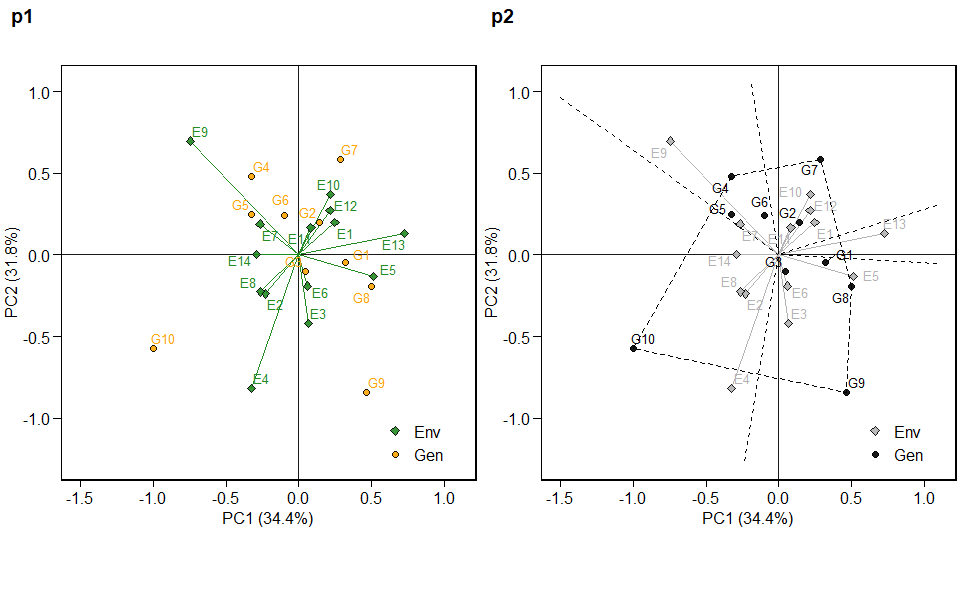
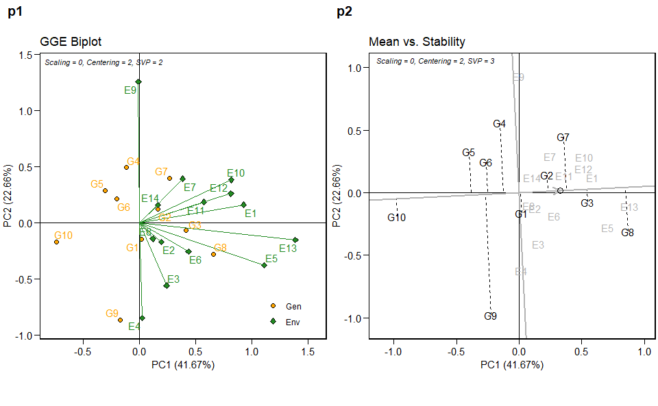

<!-- README.md is generated from README.Rmd. Please edit that file -->

# metan 

The metan (**m**ulti-**e**nvironment **t**rials **an**alysis) package
provides useful functions for analyzing multi-environment trial data
using parametric and nonparametric methods, including, but not limited
to:

  - Within-environment analysis of variance;
  - Estimation using AMMI considering different numbers of interaction
    principal component axes;
  - AMMI-based stability indexes;
  - GGE biplot analysis;
  - Prediction in mixed-effect models;
  - BLUP-based stability indexes;
  - Variance components and genetic parameters in mixed-effect models;
  - Cross-validation procedures for AMMI-family and BLUP models;
  - Graphics tools for generating biplots;
  - Parametric and nonparametric stability statistics

For more details see the [complete
vignette](https://tiagoolivoto.github.io/metan/).

# Installation

The latest development version can be download from GitHub by running

``` r
# install.packages("devtools")
devtools::install_github("TiagoOlivoto/metan")
```

# Getting started

Here, we will use the example dataset `data_ge` that contains data on
two variables assessed in 10 genotypes growing in 14 environments. For
more details see `?data_ge`

``` r
library(metan)
library(ggplot2) # used to create the plots
library(kableExtra) # Used to produce HTML tables
print_table = function(table){
  kable(table, "html", digits = 3) %>%
    kable_styling(bootstrap_options = c("striped", "hover", "condensed", "responsive"),
                  font_size = 12)
}
str(data_ge)
#> Classes 'tbl_df', 'tbl' and 'data.frame':    420 obs. of  5 variables:
#>  $ ENV: Factor w/ 14 levels "E1","E10","E11",..: 1 1 1 1 1 1 1 1 1 1 ...
#>  $ GEN: Factor w/ 10 levels "G1","G10","G2",..: 1 1 1 3 3 3 4 4 4 5 ...
#>  $ REP: Factor w/ 3 levels "1","2","3": 1 2 3 1 2 3 1 2 3 1 ...
#>  $ GY : num  2.17 2.5 2.43 3.21 2.93 ...
#>  $ HM : num  44.9 46.9 47.8 45.2 45.3 ...
```

## AMMI model

### Fitting the model

The AMMI model is fitted with the function `waas()`. For more details,
see the [complete
vignette](https://tiagoolivoto.github.io/metan/articles/vignettes_ammi.html).

``` r
model <- waas(data_ge,
              resp = GY,
              gen = GEN,
              env = ENV,
              rep = REP,
              verbose = FALSE)
```

### Predicting the response variable

The S3 method `predict()` is implemented for objects of class `waas` and
may be used to estimate the response of each genotype in each
environment considering different number of Interaction Principal
Component Axis (IPCA). For example, we will use four IPCA (number of
significant IPCAs) to estimate the variable GY using the `model` object.
Note that `$GY` was used because using the `predict()` function to a
model of class `waas` return a list, with one `tbl_df` for each
variable.

``` r
predict(model, naxis = 4)$GY %>% 
  head() %>% 
  print_table()
```

<table class="table table-striped table-hover table-condensed table-responsive" style="font-size: 12px; margin-left: auto; margin-right: auto;">

<thead>

<tr>

<th style="text-align:left;">

ENV

</th>

<th style="text-align:left;">

GEN

</th>

<th style="text-align:right;">

Y

</th>

<th style="text-align:right;">

resOLS

</th>

<th style="text-align:right;">

Ypred

</th>

<th style="text-align:right;">

ResAMMI

</th>

<th style="text-align:right;">

YpredAMMI

</th>

<th style="text-align:right;">

AMMI0

</th>

</tr>

</thead>

<tbody>

<tr>

<td style="text-align:left;">

E1

</td>

<td style="text-align:left;">

G1

</td>

<td style="text-align:right;">

2.366

</td>

<td style="text-align:right;">

\-0.084

</td>

<td style="text-align:right;">

2.450

</td>

<td style="text-align:right;">

0.07115484

</td>

<td style="text-align:right;">

2.521273

</td>

<td style="text-align:right;">

2.450

</td>

</tr>

<tr>

<td style="text-align:left;">

E1

</td>

<td style="text-align:left;">

G10

</td>

<td style="text-align:right;">

1.974

</td>

<td style="text-align:right;">

\-0.344

</td>

<td style="text-align:right;">

2.318

</td>

<td style="text-align:right;">

\-0.35391141

</td>

<td style="text-align:right;">

1.963751

</td>

<td style="text-align:right;">

2.318

</td>

</tr>

<tr>

<td style="text-align:left;">

E1

</td>

<td style="text-align:left;">

G2

</td>

<td style="text-align:right;">

2.902

</td>

<td style="text-align:right;">

0.311

</td>

<td style="text-align:right;">

2.591

</td>

<td style="text-align:right;">

0.29035016

</td>

<td style="text-align:right;">

2.880939

</td>

<td style="text-align:right;">

2.591

</td>

</tr>

<tr>

<td style="text-align:left;">

E1

</td>

<td style="text-align:left;">

G3

</td>

<td style="text-align:right;">

2.889

</td>

<td style="text-align:right;">

0.087

</td>

<td style="text-align:right;">

2.802

</td>

<td style="text-align:right;">

\-0.04518795

</td>

<td style="text-align:right;">

2.756598

</td>

<td style="text-align:right;">

2.802

</td>

</tr>

<tr>

<td style="text-align:left;">

E1

</td>

<td style="text-align:left;">

G4

</td>

<td style="text-align:right;">

2.589

</td>

<td style="text-align:right;">

0.100

</td>

<td style="text-align:right;">

2.488

</td>

<td style="text-align:right;">

0.04942370

</td>

<td style="text-align:right;">

2.537781

</td>

<td style="text-align:right;">

2.488

</td>

</tr>

<tr>

<td style="text-align:left;">

E1

</td>

<td style="text-align:left;">

G5

</td>

<td style="text-align:right;">

2.188

</td>

<td style="text-align:right;">

\-0.196

</td>

<td style="text-align:right;">

2.384

</td>

<td style="text-align:right;">

\-0.07091881

</td>

<td style="text-align:right;">

2.312867

</td>

<td style="text-align:right;">

2.384

</td>

</tr>

</tbody>

</table>

### Biplots

ggplot2-based graphics are easily obtained in metan package. For
example, the well-known AMMI2 biplot may be obtained as follows. Please,
note that since `waas()` function allows analyzing multiple variables at
the same time, e.g., `resp = c(v1, v2, ...)`, the output `model` is a
list, in this case with one element, GY.

``` r
p1 = plot_scores(model$GY, axis.expand = 1.5)
p2 = plot_scores(model$GY,
                 type = 1,
                 polygon = TRUE,
                 # col.gen = "black",
                 col.env = "gray70",
                 col.segm.env = "gray70",
                 axis.expand = 1.5)
arrange_ggplot(p1, p2, labels = c("p1","p2"))
```



## GGE model

The GGE model is fitted with the function `gge()`. For more details, see
the [complete
vignette](https://tiagoolivoto.github.io/metan/articles/vignettes_gge.html).

``` r
model <- gge(data_ge, ENV, GEN, GY)
model2 <- gge(data_ge, ENV, GEN, GY, svp = "symmetrical")
p1 <- plot(model)
p2 <- plot(model2,
           type = 2,
           col.gen = "black",
           col.env = "gray70",
           axis.expand = 1.5)
arrange_ggplot(p1, p2, labels = c("p1","p2"))
```



## BLUP model

Linear-mixed effect models to predict the response variable in METs are
fitted using the function `waasb()`. Here we will obtain the predicted
means for genotypes in the variables `GY` and `HM`. For more details,
see the [complete
vignette](https://tiagoolivoto.github.io/metan/articles/vignettes_blup.html).

``` r
model2 <- waasb(data_ge, ENV, GEN, REP,
                resp = c(GY, HM),
                verbose = FALSE)

get_model_data(model2, what = "blupg") %>% 
  print_table()
```

<table class="table table-striped table-hover table-condensed table-responsive" style="font-size: 12px; margin-left: auto; margin-right: auto;">

<thead>

<tr>

<th style="text-align:left;">

gen

</th>

<th style="text-align:right;">

GY

</th>

<th style="text-align:right;">

HM

</th>

</tr>

</thead>

<tbody>

<tr>

<td style="text-align:left;">

G1

</td>

<td style="text-align:right;">

2.617

</td>

<td style="text-align:right;">

47.396

</td>

</tr>

<tr>

<td style="text-align:left;">

G10

</td>

<td style="text-align:right;">

2.509

</td>

<td style="text-align:right;">

48.375

</td>

</tr>

<tr>

<td style="text-align:left;">

G2

</td>

<td style="text-align:right;">

2.731

</td>

<td style="text-align:right;">

47.108

</td>

</tr>

<tr>

<td style="text-align:left;">

G3

</td>

<td style="text-align:right;">

2.903

</td>

<td style="text-align:right;">

47.756

</td>

</tr>

<tr>

<td style="text-align:left;">

G4

</td>

<td style="text-align:right;">

2.648

</td>

<td style="text-align:right;">

48.050

</td>

</tr>

<tr>

<td style="text-align:left;">

G5

</td>

<td style="text-align:right;">

2.563

</td>

<td style="text-align:right;">

48.918

</td>

</tr>

<tr>

<td style="text-align:left;">

G6

</td>

<td style="text-align:right;">

2.560

</td>

<td style="text-align:right;">

48.530

</td>

</tr>

<tr>

<td style="text-align:left;">

G7

</td>

<td style="text-align:right;">

2.729

</td>

<td style="text-align:right;">

48.004

</td>

</tr>

<tr>

<td style="text-align:left;">

G8

</td>

<td style="text-align:right;">

2.943

</td>

<td style="text-align:right;">

48.784

</td>

</tr>

<tr>

<td style="text-align:left;">

G9

</td>

<td style="text-align:right;">

2.541

</td>

<td style="text-align:right;">

47.962

</td>

</tr>

</tbody>

</table>

### Plotting the BLUPs for genotypes

To produce a plot with the predicted means, use the function
`plot_blup()`.

``` r
p1 = plot_blup(model2$GY)
p2 = plot_blup(model2$GY,
               prob = 0.1,
               col.shape  =  c("gray20", "gray80")) + coord_flip()
arrange_ggplot(p1, p2, labels = c("p1","p2"))
```


### BLUPS for genotype-vs-environment interaction

The object `BLUPgge` contains the blups for the genotype-vs-environment
interaction. In the following example, the values for `GY` are shown.

``` r
model2$GY$BLUPgge[1:5,] %>% 
  head() %>% 
  print_table()
```

<table class="table table-striped table-hover table-condensed table-responsive" style="font-size: 12px; margin-left: auto; margin-right: auto;">

<thead>

<tr>

<th style="text-align:left;">

ENV

</th>

<th style="text-align:left;">

GEN

</th>

<th style="text-align:right;">

BLUPge

</th>

<th style="text-align:right;">

BLUPg

</th>

<th style="text-align:right;">

BLUPg+ge

</th>

<th style="text-align:right;">

Predicted

</th>

<th style="text-align:right;">

LL

</th>

<th style="text-align:right;">

UL

</th>

</tr>

</thead>

<tbody>

<tr>

<td style="text-align:left;">

E1

</td>

<td style="text-align:left;">

G1

</td>

<td style="text-align:right;">

\-0.062

</td>

<td style="text-align:right;">

\-0.058

</td>

<td style="text-align:right;">

\-0.120

</td>

<td style="text-align:right;">

2.401

</td>

<td style="text-align:right;">

2.298

</td>

<td style="text-align:right;">

2.505

</td>

</tr>

<tr>

<td style="text-align:left;">

E1

</td>

<td style="text-align:left;">

G10

</td>

<td style="text-align:right;">

\-0.243

</td>

<td style="text-align:right;">

\-0.166

</td>

<td style="text-align:right;">

\-0.409

</td>

<td style="text-align:right;">

2.112

</td>

<td style="text-align:right;">

2.009

</td>

<td style="text-align:right;">

2.216

</td>

</tr>

<tr>

<td style="text-align:left;">

E1

</td>

<td style="text-align:left;">

G2

</td>

<td style="text-align:right;">

0.207

</td>

<td style="text-align:right;">

0.057

</td>

<td style="text-align:right;">

0.264

</td>

<td style="text-align:right;">

2.784

</td>

<td style="text-align:right;">

2.681

</td>

<td style="text-align:right;">

2.888

</td>

</tr>

<tr>

<td style="text-align:left;">

E1

</td>

<td style="text-align:left;">

G3

</td>

<td style="text-align:right;">

0.088

</td>

<td style="text-align:right;">

0.229

</td>

<td style="text-align:right;">

0.318

</td>

<td style="text-align:right;">

2.838

</td>

<td style="text-align:right;">

2.735

</td>

<td style="text-align:right;">

2.942

</td>

</tr>

<tr>

<td style="text-align:left;">

E1

</td>

<td style="text-align:left;">

G4

</td>

<td style="text-align:right;">

0.060

</td>

<td style="text-align:right;">

\-0.026

</td>

<td style="text-align:right;">

0.034

</td>

<td style="text-align:right;">

2.554

</td>

<td style="text-align:right;">

2.451

</td>

<td style="text-align:right;">

2.658

</td>

</tr>

</tbody>

</table>

When more than one variable is fitted, the predicted means for
genotype-vs-environment combination may be obtained for all variables in
the model using `get_model_data()`.

``` r
get_model_data(model2, what = "blupge") %>% 
  head() %>% 
  print_table()
```

<table class="table table-striped table-hover table-condensed table-responsive" style="font-size: 12px; margin-left: auto; margin-right: auto;">

<thead>

<tr>

<th style="text-align:left;">

ENV

</th>

<th style="text-align:left;">

GEN

</th>

<th style="text-align:right;">

GY

</th>

<th style="text-align:right;">

HM

</th>

</tr>

</thead>

<tbody>

<tr>

<td style="text-align:left;">

E1

</td>

<td style="text-align:left;">

G1

</td>

<td style="text-align:right;">

2.401

</td>

<td style="text-align:right;">

46.587

</td>

</tr>

<tr>

<td style="text-align:left;">

E1

</td>

<td style="text-align:left;">

G10

</td>

<td style="text-align:right;">

2.112

</td>

<td style="text-align:right;">

47.152

</td>

</tr>

<tr>

<td style="text-align:left;">

E1

</td>

<td style="text-align:left;">

G2

</td>

<td style="text-align:right;">

2.784

</td>

<td style="text-align:right;">

45.664

</td>

</tr>

<tr>

<td style="text-align:left;">

E1

</td>

<td style="text-align:left;">

G3

</td>

<td style="text-align:right;">

2.838

</td>

<td style="text-align:right;">

46.249

</td>

</tr>

<tr>

<td style="text-align:left;">

E1

</td>

<td style="text-align:left;">

G4

</td>

<td style="text-align:right;">

2.554

</td>

<td style="text-align:right;">

48.017

</td>

</tr>

<tr>

<td style="text-align:left;">

E1

</td>

<td style="text-align:left;">

G5

</td>

<td style="text-align:right;">

2.268

</td>

<td style="text-align:right;">

49.390

</td>

</tr>

</tbody>

</table>

# Getting help

  - If you encounter a clear bug, please file a minimal reproducible
    example on [github](https://github.com/TiagoOlivoto/metan/issues)

  - Suggestions and criticisms to improve the quality and usability of
    the package are welcome\!
