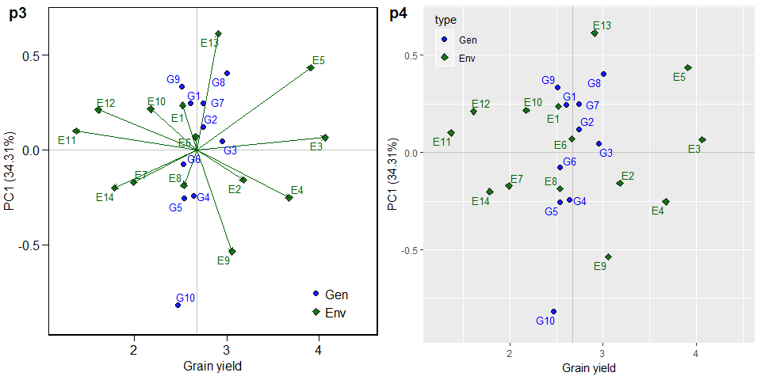
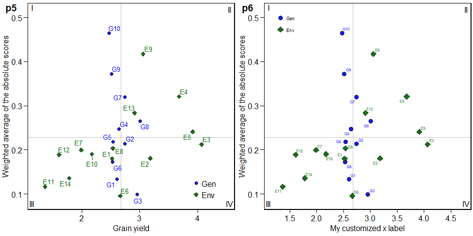
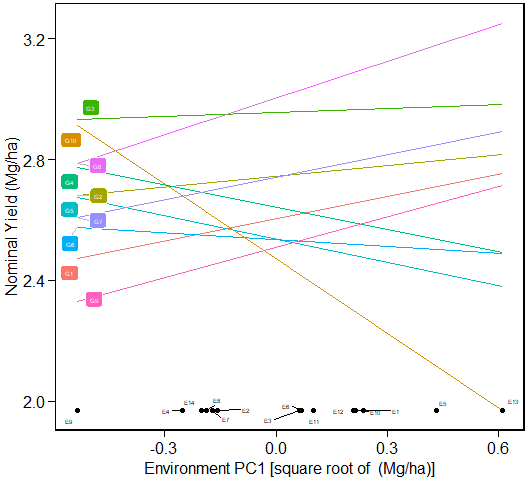

# Getting started
In this section, we will use the data in `data_ge`. For more information, please, see `?data_ge`. Other data sets can be used provided that the following columns are in the dataset: environment, genotype, block/replicate and response variable(s).


```r
library(METAAB)
library(ggplot2)
library(cowplot)
library(kableExtra)
dataset = data_ge
str(dataset)
```

```
## Classes 'tbl_df', 'tbl' and 'data.frame':	420 obs. of  5 variables:
##  $ ENV: Factor w/ 14 levels "E1","E10","E11",..: 1 1 1 1 1 1 1 1 1 1 ...
##  $ GEN: Factor w/ 10 levels "G1","G10","G2",..: 1 1 1 3 3 3 4 4 4 5 ...
##  $ REP: Factor w/ 3 levels "1","2","3": 1 2 3 1 2 3 1 2 3 1 ...
##  $ GY : num  2.17 2.5 2.43 3.21 2.93 ...
##  $ HM : num  44.9 46.9 47.8 45.2 45.3 ...
```


# The BLUP model

The simplest and well-known linear model with interaction effect used to analyze data from multi-environment trials is
	$$
	{y_{ijk}} = {\rm{ }}\mu {\rm{ }} + \mathop \alpha \nolimits_i  + \mathop \tau \nolimits_j  + \mathop {(\alpha \tau )}\nolimits_{ij}  + \mathop \gamma \nolimits_{jk}  + {\rm{ }}\mathop \varepsilon \nolimits_{ijk}
	$$
	
where ${y_{ijk}}$ is the response variable (e.g., grain yield) observed in the *k*th block of the *i*th genotype in the *j*th environment (*i* = 1, 2, ..., *g*;  *j* = 1, 2, ..., *e*; *k* = 1, 2, ..., *b*); $\mu$ is the grand mean; $\mathop \alpha \nolimits_i$ is the effect of the ith genotype; $\mathop \tau \nolimits_j$ is the effect of the *j*th environment; $\mathop {(\alpha \tau )}\nolimits_{ij}$ is the interaction effect of the *i*th genotype with the *j*th environment; $\mathop \gamma \nolimits_{jk}$ is the effect of the *k*th block within the *j*th environment; and $\mathop \varepsilon \nolimits_{ijk}$ is the random error. In a mixed-effect model assuming ${\alpha _i}$ and $\mathop {(\alpha \tau )}\nolimits_{ij}$ to be random effects, the above model can be rewritten as follows

$$
{\boldsymbol{y  = X\beta  + Zu + \varepsilon }}
$$

where  **y ** is an $n[ = \sum\nolimits_{j = 1}^e {(gb)]}  \times 1$ vector of response variable ${\bf{y}} = {\rm{ }}{\left[ {{y_{111}},{\rm{ }}{y_{112}},{\rm{ }} \ldots ,{\rm{ }}{y_{geb}}} \right]^\prime }$; ${\bf{\beta }}$ is an $(eb) \times 1$ vector of unknown fixed effects ${\boldsymbol{\beta }} = [\mathop \gamma \nolimits_{11} ,\mathop \gamma \nolimits_{12} ,...,\mathop \gamma \nolimits_{eb} ]'$;  **u** is an $m[ = g + ge] \times 1$ vector of random effects ${\boldsymbol{u}} = {\rm{ }}{\left[ {{\alpha _1},{\alpha _2},...,{\alpha _g},\mathop {(\alpha \tau )}\nolimits_{11} ,\mathop {(\alpha \tau )}\nolimits_{12} ,...,\mathop {(\alpha \tau )}\nolimits_{ge} } \right]^\prime }$;  **X **  is an $n \times (eb)$ design matrix relating  **y** to ${\bf{\beta }}$;  **Z ** is an $n \times m$ design matrix relating  **y** to  **u **; ${\boldsymbol{\varepsilon }}$ is an $n \times 1$ vector of random errors ${\boldsymbol{\varepsilon }} = {\rm{ }}{\left[ {{y_{111}},{\rm{ }}{y_{112}},{\rm{ }} \ldots ,{\rm{ }}{y_{geb}}} \right]^\prime }$;

The vectors ${\boldsymbol{\beta }}$ and **u** are estimated using the well-known mixed model equation [@Henderson1975].
	$$
	\left[ {\begin{array}{*{20}{c}}{{\boldsymbol{\hat \beta }}}\\{{\bf{\hat u}}}\end{array}} \right]{\bf{ = }}{\left[ {\begin{array}{*{20}{c}}{{\bf{X'}}{{\bf{R}}^{ - {\bf{1}}}}{\bf{X}}}&{{\bf{X'}}{{\bf{R}}^{ - {\bf{1}}}}{\bf{Z}}}\\{{\bf{Z'}}{{\bf{R}}^{ - {\bf{1}}}}{\bf{X}}}&{{\bf{Z'}}{{\bf{R}}^{ - {\bf{1}}}}{\bf{Z + }}{{\bf{G}}^{ - {\bf{1}}}}}\end{array}} \right]^ - }\left[ {\begin{array}{*{20}{c}}{{\bf{X'}}{{\bf{R}}^{ - {\bf{1}}}}{\bf{y}}}\\{{\bf{Z'}}{{\bf{R}}^{ - {\bf{1}}}}{\bf{y}}}\end{array}} \right]
	$$
where **G** and **R** are the variance-covariance matrices for random-effect vector **u** and residual vector ${\bf{\varepsilon }}$, respectively.


The `WAASB()` is used to fit the linear mixed-effect model. The first argument is the data, in our example `dataset`. By default, genotype and genotype-vs-environment interaction are assumed to be random effects. Other effects may be considered using the `random` argument. Please, see `?WAASB` for more details.  The argument (`resp`) is the response variable to be analyzed. The function allow a single variable (in this case GY) or a vector of response variables. The arguments (`gen`, `env`, and `rep`) are the name of the columns that contais the levels for genotypes, environments, and replications, respectively. The last argument (`verbose`) control if the code is run silently or not.


```r
WAASB_model = WAASB(data = dataset,
                    random = "gen", #Default
                    resp = GY,
                    gen = GEN,
                    env = ENV,
                    rep = REP,
                    verbose = TRUE) #Default
```

```
## Done!
```


## Diagnostic plot for residuals
The function `autoplot()` is used to generate diagnostic plots of residuals of the model. The normality of the random effects of genotype and interaction effects may be also obtained by using `type = "re"`. Please, see `?autoplot.WAASB` for more details.


```r
autoplot(WAASB_model$GY)
```


```r
autoplot(WAASB_model$GY, type = "re")
```


## Printing the model outputs

### Likelihood Ratio Tests

The output `LRT` contains the Likelihood Ratio Tests for genotype and genotype-vs-environment random effects.


```r
options(digits = 5)
data = WAASB_model$GY$LRT
kable(data, "html") %>%
  kable_styling(bootstrap_options = "striped", "condensed",
                position = "left", full_width = F, font_size = 12)
```

<table class="table table-striped" style="font-size: 12px; width: auto !important; ">
 <thead>
  <tr>
   <th style="text-align:left;">   </th>
   <th style="text-align:right;"> npar </th>
   <th style="text-align:right;"> logLik </th>
   <th style="text-align:right;"> AIC </th>
   <th style="text-align:right;"> LRT </th>
   <th style="text-align:right;"> Df </th>
   <th style="text-align:right;"> Pr(&gt;Chisq) </th>
  </tr>
 </thead>
<tbody>
  <tr>
   <td style="text-align:left;"> Complete </td>
   <td style="text-align:right;"> 45 </td>
   <td style="text-align:right;"> -214.72 </td>
   <td style="text-align:right;"> 519.43 </td>
   <td style="text-align:right;"> NA </td>
   <td style="text-align:right;"> NA </td>
   <td style="text-align:right;"> NA </td>
  </tr>
  <tr>
   <td style="text-align:left;"> Genotype </td>
   <td style="text-align:right;"> 44 </td>
   <td style="text-align:right;"> -224.37 </td>
   <td style="text-align:right;"> 536.75 </td>
   <td style="text-align:right;"> 19.315 </td>
   <td style="text-align:right;"> 1 </td>
   <td style="text-align:right;"> 1e-05 </td>
  </tr>
  <tr>
   <td style="text-align:left;"> Gen vs Env </td>
   <td style="text-align:right;"> 44 </td>
   <td style="text-align:right;"> -237.13 </td>
   <td style="text-align:right;"> 562.27 </td>
   <td style="text-align:right;"> 44.832 </td>
   <td style="text-align:right;"> 1 </td>
   <td style="text-align:right;"> 0e+00 </td>
  </tr>
</tbody>
</table>


### Variance components and genetic parameters

In the output `ESTIMATES`, beyond the variance components for the declared random effects, some important parameters are also shown. **Heribatility** is the broad-sense heritability, $\mathop h\nolimits_g^2$, estimated by
$$
\mathop h\nolimits_g^2  = \frac{\mathop {\hat\sigma} \nolimits_g^2} {\mathop {\hat\sigma} \nolimits_g^2  + \mathop {\hat\sigma} \nolimits_i^2  + \mathop {\hat\sigma} \nolimits_e^2 }
$$

where $\mathop {\hat\sigma} \nolimits_g^2$ is the genotypic variance; $\mathop {\hat\sigma} \nolimits_i^2$ is the genotype-by-environment interaction variance; and $\mathop {\hat\sigma} \nolimits_e^2$ is the residual variance. **GEIr2** is the coefficient of determination of the interaction effects, $\mathop r\nolimits_i^2$, estimated by 

$$
\mathop r\nolimits_i^2  = \frac{\mathop {\hat\sigma} \nolimits_i^2}
{\mathop {\hat\sigma} \nolimits_g^2  + \mathop {\hat\sigma} \nolimits_i^2  + \mathop {\hat\sigma} \nolimits_e^2 }
$$
**Heribatility of means** is the heribability on the mean basis, $\mathop h\nolimits_{gm}^2$, estimated by 

$$
\mathop h\nolimits_{gm}^2  = \frac{\mathop {\hat\sigma} \nolimits_g^2}{[\mathop {\hat\sigma} \nolimits_g^2  + \mathop {\hat\sigma} \nolimits_i^2 /e + \mathop {\hat\sigma} \nolimits_e^2 /\left( {eb} \right)]}
$$

where *e* and *b* are the number of environments and blocks, respectively; **Accuracy** is the accuracy of selection, *Ac*, estimated by
$$
Ac = \sqrt{\mathop h\nolimits_{gm}^2}
$$

**rge** is the genotype-environment correlation,  $\mathop r\nolimits_{ge}$, estimated by

$$
\mathop r\nolimits_{ge} = \frac{\mathop {\hat\sigma} \nolimits_g^2}{\mathop {\hat\sigma} \nolimits_g^2  + \mathop {\hat\sigma} \nolimits_i^2}
$$

**CVg** and **CVr** are the the genotypic coefficient of variation and the residual coefficient of variation estimated, respectively, by 
$$
CVg  = \left( {\sqrt {\mathop {\hat \sigma }\nolimits_g^2 } /\mu } \right) \times 100
$$
and 
$$
CVr = \left( {\sqrt {\mathop {\hat \sigma }\nolimits_e^2 } /\mu } \right) \times 100
$$
where $\mu$ is the grand mean.

**CV ratio** is the ratio between genotypic and residual coefficient of variation.


```r
data = WAASB_model$GY$ESTIMATES
kable(data, "html") %>%
  kable_styling(bootstrap_options = "striped", "condensed",
                position = "left", full_width = F, font_size = 12)
```

<table class="table table-striped" style="font-size: 12px; width: auto !important; ">
 <thead>
  <tr>
   <th style="text-align:left;"> Parameters </th>
   <th style="text-align:left;"> Values </th>
  </tr>
 </thead>
<tbody>
  <tr>
   <td style="text-align:left;"> GEI variance </td>
   <td style="text-align:left;"> 0.056714 (31.26% of phenotypic variance.) </td>
  </tr>
  <tr>
   <td style="text-align:left;"> Genotypic variance </td>
   <td style="text-align:left;"> 0.028025 (15.45% of phenotypic variance.) </td>
  </tr>
  <tr>
   <td style="text-align:left;"> Residual variance </td>
   <td style="text-align:left;"> 0.096693 (53.29% of phenotypic variance.) </td>
  </tr>
  <tr>
   <td style="text-align:left;"> Phenotypic variance </td>
   <td style="text-align:left;"> 0.181432000765268 </td>
  </tr>
  <tr>
   <td style="text-align:left;"> Heritability </td>
   <td style="text-align:left;"> 0.154466820776706 </td>
  </tr>
  <tr>
   <td style="text-align:left;"> GEIr2 </td>
   <td style="text-align:left;"> 0.31258908175788 </td>
  </tr>
  <tr>
   <td style="text-align:left;"> Heribatility of means </td>
   <td style="text-align:left;"> 0.815198214388929 </td>
  </tr>
  <tr>
   <td style="text-align:left;"> Accuracy </td>
   <td style="text-align:left;"> 0.902883278385932 </td>
  </tr>
  <tr>
   <td style="text-align:left;"> rge </td>
   <td style="text-align:left;"> 0.369694636992275 </td>
  </tr>
  <tr>
   <td style="text-align:left;"> CVg </td>
   <td style="text-align:left;"> 6.25999359149609 </td>
  </tr>
  <tr>
   <td style="text-align:left;"> CVr </td>
   <td style="text-align:left;"> 11.6277882108427 </td>
  </tr>
  <tr>
   <td style="text-align:left;"> CV ratio </td>
   <td style="text-align:left;"> 0.53836494765692 </td>
  </tr>
</tbody>
</table>


### Some useful information


The following pieces of information are provided in `Details` output. **WgtResponse** is the weight for the response variable in estimating WAASB; **WgtWAAS** is the weight for stability; **Ngen** is the number of genotypes; **Nenv** is the number of environments; **OVmean** is the overall mean; **Min** is the minimum value observed (returning the genotype and environment); **Max** is the maximum observed; **MinENV** is the environment with the lower mean; **MaxENV** is the environment with the largest mean observed; **MinGEN** is the genotype with the lower mean; **MaxGEN** is the genotype with the largest mean.    


```r
data = WAASB_model$GY$Details
kable(data, "html") %>%
  kable_styling(bootstrap_options = "striped", "condensed",
                position = "left", full_width = F, font_size = 12)
```

<table class="table table-striped" style="font-size: 12px; width: auto !important; ">
 <thead>
  <tr>
   <th style="text-align:left;"> Parameters </th>
   <th style="text-align:left;"> Values </th>
  </tr>
 </thead>
<tbody>
  <tr>
   <td style="text-align:left;"> Ngen </td>
   <td style="text-align:left;"> 10 </td>
  </tr>
  <tr>
   <td style="text-align:left;"> Nenv </td>
   <td style="text-align:left;"> 14 </td>
  </tr>
  <tr>
   <td style="text-align:left;"> OVmean </td>
   <td style="text-align:left;"> 2.6742 </td>
  </tr>
  <tr>
   <td style="text-align:left;"> Min </td>
   <td style="text-align:left;"> 0.8991 (Genotype G10 in E11 ) </td>
  </tr>
  <tr>
   <td style="text-align:left;"> Max </td>
   <td style="text-align:left;"> 4.8121 (Genotype G8 in E5 ) </td>
  </tr>
  <tr>
   <td style="text-align:left;"> MinENV </td>
   <td style="text-align:left;"> Environment E11 (1.3683) </td>
  </tr>
  <tr>
   <td style="text-align:left;"> MaxENV </td>
   <td style="text-align:left;"> Environment E3 (4.0643) </td>
  </tr>
  <tr>
   <td style="text-align:left;"> MinGEN </td>
   <td style="text-align:left;"> Genotype G10 (2.4712) </td>
  </tr>
  <tr>
   <td style="text-align:left;"> MaxGEN </td>
   <td style="text-align:left;"> Genotype G8 (3.0036) </td>
  </tr>
</tbody>
</table>


### The WAASB object

The `WAASB()` function computes the Weighted Average of the Absolute Scores considering all possible IPCA from the Singular Value Decomposition of the BLUPs for genotype-vs-environment interaction effects obtained by an Linear Mixed-effect Model, as follows:

$$
        WAASB_i  = 
        \sum_{k = 1}^{p} |IPCA_{ik} \times EP_k|/ \sum_{k = 1}^{p}EP_k
$$

where $WAASB_i$ is the weighted average of absolute scores of the *i*th genotype; $IPCA_{ik}$ is the scores of the *i*th genotype in the *k*th IPCA; and $EP_k$ is the explained variance of the *k*th PCA for $k = 1,2,..,p$, $p = min(g-1; e-1)$.


```r
data = WAASB_model$GY$model[, c(1:3,13:17, 21:22)]
kable(data, "html") %>%
  kable_styling(bootstrap_options = "striped", "condensed",
                position = "left", full_width = F, font_size = 12)
```

<table class="table table-striped" style="font-size: 12px; width: auto !important; ">
 <thead>
  <tr>
   <th style="text-align:left;"> type </th>
   <th style="text-align:left;"> Code </th>
   <th style="text-align:right;"> Y </th>
   <th style="text-align:right;"> WAASB </th>
   <th style="text-align:right;"> PctResp </th>
   <th style="text-align:right;"> PctWAASB </th>
   <th style="text-align:right;"> OrResp </th>
   <th style="text-align:right;"> OrWAASB </th>
   <th style="text-align:right;"> WAASBY </th>
   <th style="text-align:right;"> OrWAASBY </th>
  </tr>
 </thead>
<tbody>
  <tr>
   <td style="text-align:left;"> GEN </td>
   <td style="text-align:left;"> G1 </td>
   <td style="text-align:right;"> 2.6037 </td>
   <td style="text-align:right;"> 0.13411 </td>
   <td style="text-align:right;"> 24.8781 </td>
   <td style="text-align:right;"> 90.371 </td>
   <td style="text-align:right;"> 6 </td>
   <td style="text-align:right;"> 2 </td>
   <td style="text-align:right;"> 57.624 </td>
   <td style="text-align:right;"> 4 </td>
  </tr>
  <tr>
   <td style="text-align:left;"> GEN </td>
   <td style="text-align:left;"> G10 </td>
   <td style="text-align:right;"> 2.4712 </td>
   <td style="text-align:right;"> 0.46459 </td>
   <td style="text-align:right;"> 0.0000 </td>
   <td style="text-align:right;"> 0.000 </td>
   <td style="text-align:right;"> 10 </td>
   <td style="text-align:right;"> 10 </td>
   <td style="text-align:right;"> 0.000 </td>
   <td style="text-align:right;"> 10 </td>
  </tr>
  <tr>
   <td style="text-align:left;"> GEN </td>
   <td style="text-align:left;"> G2 </td>
   <td style="text-align:right;"> 2.7441 </td>
   <td style="text-align:right;"> 0.21382 </td>
   <td style="text-align:right;"> 51.2617 </td>
   <td style="text-align:right;"> 68.574 </td>
   <td style="text-align:right;"> 3 </td>
   <td style="text-align:right;"> 4 </td>
   <td style="text-align:right;"> 59.918 </td>
   <td style="text-align:right;"> 3 </td>
  </tr>
  <tr>
   <td style="text-align:left;"> GEN </td>
   <td style="text-align:left;"> G3 </td>
   <td style="text-align:right;"> 2.9553 </td>
   <td style="text-align:right;"> 0.09890 </td>
   <td style="text-align:right;"> 90.9294 </td>
   <td style="text-align:right;"> 100.000 </td>
   <td style="text-align:right;"> 2 </td>
   <td style="text-align:right;"> 1 </td>
   <td style="text-align:right;"> 95.465 </td>
   <td style="text-align:right;"> 1 </td>
  </tr>
  <tr>
   <td style="text-align:left;"> GEN </td>
   <td style="text-align:left;"> G4 </td>
   <td style="text-align:right;"> 2.6419 </td>
   <td style="text-align:right;"> 0.24751 </td>
   <td style="text-align:right;"> 32.0603 </td>
   <td style="text-align:right;"> 59.362 </td>
   <td style="text-align:right;"> 5 </td>
   <td style="text-align:right;"> 6 </td>
   <td style="text-align:right;"> 45.711 </td>
   <td style="text-align:right;"> 6 </td>
  </tr>
  <tr>
   <td style="text-align:left;"> GEN </td>
   <td style="text-align:left;"> G5 </td>
   <td style="text-align:right;"> 2.5373 </td>
   <td style="text-align:right;"> 0.21778 </td>
   <td style="text-align:right;"> 12.4195 </td>
   <td style="text-align:right;"> 67.490 </td>
   <td style="text-align:right;"> 7 </td>
   <td style="text-align:right;"> 5 </td>
   <td style="text-align:right;"> 39.955 </td>
   <td style="text-align:right;"> 8 </td>
  </tr>
  <tr>
   <td style="text-align:left;"> GEN </td>
   <td style="text-align:left;"> G6 </td>
   <td style="text-align:right;"> 2.5340 </td>
   <td style="text-align:right;"> 0.17212 </td>
   <td style="text-align:right;"> 11.7971 </td>
   <td style="text-align:right;"> 79.978 </td>
   <td style="text-align:right;"> 8 </td>
   <td style="text-align:right;"> 3 </td>
   <td style="text-align:right;"> 45.888 </td>
   <td style="text-align:right;"> 5 </td>
  </tr>
  <tr>
   <td style="text-align:left;"> GEN </td>
   <td style="text-align:left;"> G7 </td>
   <td style="text-align:right;"> 2.7409 </td>
   <td style="text-align:right;"> 0.31905 </td>
   <td style="text-align:right;"> 50.6536 </td>
   <td style="text-align:right;"> 39.799 </td>
   <td style="text-align:right;"> 4 </td>
   <td style="text-align:right;"> 8 </td>
   <td style="text-align:right;"> 45.226 </td>
   <td style="text-align:right;"> 7 </td>
  </tr>
  <tr>
   <td style="text-align:left;"> GEN </td>
   <td style="text-align:left;"> G8 </td>
   <td style="text-align:right;"> 3.0036 </td>
   <td style="text-align:right;"> 0.26490 </td>
   <td style="text-align:right;"> 100.0000 </td>
   <td style="text-align:right;"> 54.606 </td>
   <td style="text-align:right;"> 1 </td>
   <td style="text-align:right;"> 7 </td>
   <td style="text-align:right;"> 77.303 </td>
   <td style="text-align:right;"> 2 </td>
  </tr>
  <tr>
   <td style="text-align:left;"> GEN </td>
   <td style="text-align:left;"> G9 </td>
   <td style="text-align:right;"> 2.5102 </td>
   <td style="text-align:right;"> 0.37197 </td>
   <td style="text-align:right;"> 7.3196 </td>
   <td style="text-align:right;"> 25.326 </td>
   <td style="text-align:right;"> 9 </td>
   <td style="text-align:right;"> 9 </td>
   <td style="text-align:right;"> 16.323 </td>
   <td style="text-align:right;"> 9 </td>
  </tr>
  <tr>
   <td style="text-align:left;"> ENV </td>
   <td style="text-align:left;"> E1 </td>
   <td style="text-align:right;"> 2.5207 </td>
   <td style="text-align:right;"> 0.17987 </td>
   <td style="text-align:right;"> 42.7444 </td>
   <td style="text-align:right;"> 73.771 </td>
   <td style="text-align:right;"> 9 </td>
   <td style="text-align:right;"> 4 </td>
   <td style="text-align:right;"> 58.258 </td>
   <td style="text-align:right;"> 5 </td>
  </tr>
  <tr>
   <td style="text-align:left;"> ENV </td>
   <td style="text-align:left;"> E10 </td>
   <td style="text-align:right;"> 2.1752 </td>
   <td style="text-align:right;"> 0.19044 </td>
   <td style="text-align:right;"> 29.9304 </td>
   <td style="text-align:right;"> 70.487 </td>
   <td style="text-align:right;"> 10 </td>
   <td style="text-align:right;"> 7 </td>
   <td style="text-align:right;"> 50.209 </td>
   <td style="text-align:right;"> 9 </td>
  </tr>
  <tr>
   <td style="text-align:left;"> ENV </td>
   <td style="text-align:left;"> E11 </td>
   <td style="text-align:right;"> 1.3683 </td>
   <td style="text-align:right;"> 0.11651 </td>
   <td style="text-align:right;"> 0.0000 </td>
   <td style="text-align:right;"> 93.472 </td>
   <td style="text-align:right;"> 14 </td>
   <td style="text-align:right;"> 2 </td>
   <td style="text-align:right;"> 46.736 </td>
   <td style="text-align:right;"> 11 </td>
  </tr>
  <tr>
   <td style="text-align:left;"> ENV </td>
   <td style="text-align:left;"> E12 </td>
   <td style="text-align:right;"> 1.6085 </td>
   <td style="text-align:right;"> 0.18877 </td>
   <td style="text-align:right;"> 8.9110 </td>
   <td style="text-align:right;"> 71.005 </td>
   <td style="text-align:right;"> 13 </td>
   <td style="text-align:right;"> 6 </td>
   <td style="text-align:right;"> 39.958 </td>
   <td style="text-align:right;"> 13 </td>
  </tr>
  <tr>
   <td style="text-align:left;"> ENV </td>
   <td style="text-align:left;"> E13 </td>
   <td style="text-align:right;"> 2.9096 </td>
   <td style="text-align:right;"> 0.28349 </td>
   <td style="text-align:right;"> 57.1709 </td>
   <td style="text-align:right;"> 41.553 </td>
   <td style="text-align:right;"> 6 </td>
   <td style="text-align:right;"> 12 </td>
   <td style="text-align:right;"> 49.362 </td>
   <td style="text-align:right;"> 10 </td>
  </tr>
  <tr>
   <td style="text-align:left;"> ENV </td>
   <td style="text-align:left;"> E14 </td>
   <td style="text-align:right;"> 1.7819 </td>
   <td style="text-align:right;"> 0.13595 </td>
   <td style="text-align:right;"> 15.3434 </td>
   <td style="text-align:right;"> 87.428 </td>
   <td style="text-align:right;"> 12 </td>
   <td style="text-align:right;"> 3 </td>
   <td style="text-align:right;"> 51.386 </td>
   <td style="text-align:right;"> 8 </td>
  </tr>
  <tr>
   <td style="text-align:left;"> ENV </td>
   <td style="text-align:left;"> E2 </td>
   <td style="text-align:right;"> 3.1800 </td>
   <td style="text-align:right;"> 0.18059 </td>
   <td style="text-align:right;"> 67.1976 </td>
   <td style="text-align:right;"> 73.549 </td>
   <td style="text-align:right;"> 4 </td>
   <td style="text-align:right;"> 5 </td>
   <td style="text-align:right;"> 70.373 </td>
   <td style="text-align:right;"> 4 </td>
  </tr>
  <tr>
   <td style="text-align:left;"> ENV </td>
   <td style="text-align:left;"> E3 </td>
   <td style="text-align:right;"> 4.0643 </td>
   <td style="text-align:right;"> 0.21219 </td>
   <td style="text-align:right;"> 100.0000 </td>
   <td style="text-align:right;"> 63.722 </td>
   <td style="text-align:right;"> 1 </td>
   <td style="text-align:right;"> 10 </td>
   <td style="text-align:right;"> 81.861 </td>
   <td style="text-align:right;"> 1 </td>
  </tr>
  <tr>
   <td style="text-align:left;"> ENV </td>
   <td style="text-align:left;"> E4 </td>
   <td style="text-align:right;"> 3.6753 </td>
   <td style="text-align:right;"> 0.32075 </td>
   <td style="text-align:right;"> 85.5693 </td>
   <td style="text-align:right;"> 29.969 </td>
   <td style="text-align:right;"> 3 </td>
   <td style="text-align:right;"> 13 </td>
   <td style="text-align:right;"> 57.769 </td>
   <td style="text-align:right;"> 6 </td>
  </tr>
  <tr>
   <td style="text-align:left;"> ENV </td>
   <td style="text-align:left;"> E5 </td>
   <td style="text-align:right;"> 3.9105 </td>
   <td style="text-align:right;"> 0.24101 </td>
   <td style="text-align:right;"> 94.2942 </td>
   <td style="text-align:right;"> 54.763 </td>
   <td style="text-align:right;"> 2 </td>
   <td style="text-align:right;"> 11 </td>
   <td style="text-align:right;"> 74.528 </td>
   <td style="text-align:right;"> 2 </td>
  </tr>
  <tr>
   <td style="text-align:left;"> ENV </td>
   <td style="text-align:left;"> E6 </td>
   <td style="text-align:right;"> 2.6632 </td>
   <td style="text-align:right;"> 0.09552 </td>
   <td style="text-align:right;"> 48.0310 </td>
   <td style="text-align:right;"> 100.000 </td>
   <td style="text-align:right;"> 7 </td>
   <td style="text-align:right;"> 1 </td>
   <td style="text-align:right;"> 74.016 </td>
   <td style="text-align:right;"> 3 </td>
  </tr>
  <tr>
   <td style="text-align:left;"> ENV </td>
   <td style="text-align:left;"> E7 </td>
   <td style="text-align:right;"> 1.9889 </td>
   <td style="text-align:right;"> 0.19967 </td>
   <td style="text-align:right;"> 23.0199 </td>
   <td style="text-align:right;"> 67.615 </td>
   <td style="text-align:right;"> 11 </td>
   <td style="text-align:right;"> 8 </td>
   <td style="text-align:right;"> 45.318 </td>
   <td style="text-align:right;"> 12 </td>
  </tr>
  <tr>
   <td style="text-align:left;"> ENV </td>
   <td style="text-align:left;"> E8 </td>
   <td style="text-align:right;"> 2.5364 </td>
   <td style="text-align:right;"> 0.20337 </td>
   <td style="text-align:right;"> 43.3265 </td>
   <td style="text-align:right;"> 66.467 </td>
   <td style="text-align:right;"> 8 </td>
   <td style="text-align:right;"> 9 </td>
   <td style="text-align:right;"> 54.897 </td>
   <td style="text-align:right;"> 7 </td>
  </tr>
  <tr>
   <td style="text-align:left;"> ENV </td>
   <td style="text-align:left;"> E9 </td>
   <td style="text-align:right;"> 3.0566 </td>
   <td style="text-align:right;"> 0.41713 </td>
   <td style="text-align:right;"> 62.6221 </td>
   <td style="text-align:right;"> 0.000 </td>
   <td style="text-align:right;"> 5 </td>
   <td style="text-align:right;"> 14 </td>
   <td style="text-align:right;"> 31.311 </td>
   <td style="text-align:right;"> 14 </td>
  </tr>
</tbody>
</table>

The output generated by the `WAASB()` function is very similar to those generated by the `WAAS.AMMI()` function. The main difference here, is that the singular value decomposition is based on the BLUP for GEI effects matrix.

### BLUP for genotypes


```r
data = WAASB_model$GY$blupGEN[1:5,]
kable(data, "html") %>%
  kable_styling(bootstrap_options = "striped", "condensed",
                position = "left", full_width = F, font_size = 12)
```

<table class="table table-striped" style="font-size: 12px; width: auto !important; ">
 <thead>
  <tr>
   <th style="text-align:right;"> Rank </th>
   <th style="text-align:left;"> GEN </th>
   <th style="text-align:right;"> BLUPg </th>
   <th style="text-align:right;"> Predicted </th>
   <th style="text-align:right;"> LL </th>
   <th style="text-align:right;"> UL </th>
  </tr>
 </thead>
<tbody>
  <tr>
   <td style="text-align:right;"> 1 </td>
   <td style="text-align:left;"> G8 </td>
   <td style="text-align:right;"> 0.26852 </td>
   <td style="text-align:right;"> 2.9428 </td>
   <td style="text-align:right;"> 2.8393 </td>
   <td style="text-align:right;"> 3.0463 </td>
  </tr>
  <tr>
   <td style="text-align:right;"> 2 </td>
   <td style="text-align:left;"> G3 </td>
   <td style="text-align:right;"> 0.22915 </td>
   <td style="text-align:right;"> 2.9034 </td>
   <td style="text-align:right;"> 2.7999 </td>
   <td style="text-align:right;"> 3.0069 </td>
  </tr>
  <tr>
   <td style="text-align:right;"> 3 </td>
   <td style="text-align:left;"> G2 </td>
   <td style="text-align:right;"> 0.05699 </td>
   <td style="text-align:right;"> 2.7312 </td>
   <td style="text-align:right;"> 2.6277 </td>
   <td style="text-align:right;"> 2.8347 </td>
  </tr>
  <tr>
   <td style="text-align:right;"> 4 </td>
   <td style="text-align:left;"> G7 </td>
   <td style="text-align:right;"> 0.05435 </td>
   <td style="text-align:right;"> 2.7286 </td>
   <td style="text-align:right;"> 2.6251 </td>
   <td style="text-align:right;"> 2.8321 </td>
  </tr>
  <tr>
   <td style="text-align:right;"> 5 </td>
   <td style="text-align:left;"> G4 </td>
   <td style="text-align:right;"> -0.02635 </td>
   <td style="text-align:right;"> 2.6479 </td>
   <td style="text-align:right;"> 2.5444 </td>
   <td style="text-align:right;"> 2.7514 </td>
  </tr>
</tbody>
</table>


### Plotting the BLUP for genotypes


```r
# No file exported
p1 = plot.blup(WAASB_model$GY)
p2 = plot.blup(WAASB_model$GY, 
               col.shape  =  c("gray20", "gray80")) + coord_flip()
plot_grid(p1, p2,
          labels = c("p1", "p2"))
```


This output shows the predicted means for genotypes. **BLUPg** is the genotypic effect $(\hat{g}_{i})$, which considering balanced data and genotype as random effect is estimated by

$$
\hat{g}_{i} = h_g^2(\bar{y}_{i.}-\bar{y}_{..})
$$

where $h_g^2$ is the shrinkage effect for genotype. **Predicted** is the predicted mean estimated by
$$
\hat{g}_{i}+\mu
$$

where $\mu$ is the grand mean. **LL** and **UL** are the lower and upper limits, respectively, estimated by 
$$
(\hat{g}_{i}+\mu)\pm{CI}
$$
with
$$
CI = t\times\sqrt{((1-Ac)\times{\mathop \sigma \nolimits_g^2)}}
$$

where $t$ is the Student's *t* value for a two-tailed *t* test at a given probability error; $Ac$ is the accuracy of selection and $\mathop \sigma \nolimits_g^2$ is the genotypic variance.

### BLUP for genotypes X environment combination


```r
data = WAASB_model$GY$BLUPgge[1:5,]
kable(data, "html") %>%
  kable_styling(bootstrap_options = "striped", "condensed",
                position = "left", full_width = F, font_size = 12)
```

<table class="table table-striped" style="font-size: 12px; width: auto !important; ">
 <thead>
  <tr>
   <th style="text-align:left;"> ENV </th>
   <th style="text-align:left;"> GEN </th>
   <th style="text-align:right;"> BLUPge </th>
   <th style="text-align:right;"> BLUPg </th>
   <th style="text-align:right;"> BLUPg+ge </th>
   <th style="text-align:right;"> Predicted </th>
   <th style="text-align:right;"> LL </th>
   <th style="text-align:right;"> UL </th>
  </tr>
 </thead>
<tbody>
  <tr>
   <td style="text-align:left;"> E1 </td>
   <td style="text-align:left;"> G1 </td>
   <td style="text-align:right;"> -0.06209 </td>
   <td style="text-align:right;"> -0.05752 </td>
   <td style="text-align:right;"> -0.11961 </td>
   <td style="text-align:right;"> 2.4011 </td>
   <td style="text-align:right;"> 2.2976 </td>
   <td style="text-align:right;"> 2.5046 </td>
  </tr>
  <tr>
   <td style="text-align:left;"> E1 </td>
   <td style="text-align:left;"> G10 </td>
   <td style="text-align:right;"> -0.24301 </td>
   <td style="text-align:right;"> -0.16550 </td>
   <td style="text-align:right;"> -0.40851 </td>
   <td style="text-align:right;"> 2.1122 </td>
   <td style="text-align:right;"> 2.0087 </td>
   <td style="text-align:right;"> 2.2157 </td>
  </tr>
  <tr>
   <td style="text-align:left;"> E1 </td>
   <td style="text-align:left;"> G2 </td>
   <td style="text-align:right;"> 0.20664 </td>
   <td style="text-align:right;"> 0.05699 </td>
   <td style="text-align:right;"> 0.26363 </td>
   <td style="text-align:right;"> 2.7843 </td>
   <td style="text-align:right;"> 2.6808 </td>
   <td style="text-align:right;"> 2.8878 </td>
  </tr>
  <tr>
   <td style="text-align:left;"> E1 </td>
   <td style="text-align:left;"> G3 </td>
   <td style="text-align:right;"> 0.08847 </td>
   <td style="text-align:right;"> 0.22915 </td>
   <td style="text-align:right;"> 0.31762 </td>
   <td style="text-align:right;"> 2.8383 </td>
   <td style="text-align:right;"> 2.7348 </td>
   <td style="text-align:right;"> 2.9418 </td>
  </tr>
  <tr>
   <td style="text-align:left;"> E1 </td>
   <td style="text-align:left;"> G4 </td>
   <td style="text-align:right;"> 0.06009 </td>
   <td style="text-align:right;"> -0.02635 </td>
   <td style="text-align:right;"> 0.03374 </td>
   <td style="text-align:right;"> 2.5544 </td>
   <td style="text-align:right;"> 2.4509 </td>
   <td style="text-align:right;"> 2.6579 </td>
  </tr>
</tbody>
</table>

This output shows the predicted means for each genotype and environment combination. **BLUPg** is the genotypic effect described above. **BLUPge** is the genotypic effect of the *i*th genotype in the *j*th environment $(\hat{g}_{ij})$, which considering balanced data and genotype as random effect is estimated by
$$\hat{g}_{ij} = h_g^2(\bar{y}_{i.}-\bar{y}_{..})+h_{ge}^2(y_{ij}-\bar{y}_{i.}-\bar{y}_{.j}+\bar{y}_{..})$$
where $h_{ge}^2$ is the shrinkage effect for the genotype-by-environment interaction; **BLUPg+ge** is $BLUP_g+BLUP_{ge}$; **Predicted** is the predicted mean ($\hat{y}_{ij}$) estimated by
$$
\hat{y}_{ij} = \bar{y}_{.j}+BLUP_{g+ge}
$$

## Eigenvalues of the BLUP_GEI matrix


```r
data = WAASB_model$GY$PCA
kable(data, "html") %>%
  kable_styling(bootstrap_options = "striped", "condensed",
                position = "left", full_width = F, font_size = 12)
```

<table class="table table-striped" style="font-size: 12px; width: auto !important; ">
 <thead>
  <tr>
   <th style="text-align:left;"> PC </th>
   <th style="text-align:right;"> Eigenvalue </th>
   <th style="text-align:right;"> Proportion </th>
   <th style="text-align:right;"> Accumulated </th>
  </tr>
 </thead>
<tbody>
  <tr>
   <td style="text-align:left;"> 1 </td>
   <td style="text-align:right;"> 1.47222 </td>
   <td style="text-align:right;"> 34.30838 </td>
   <td style="text-align:right;"> 34.308 </td>
  </tr>
  <tr>
   <td style="text-align:left;"> 2 </td>
   <td style="text-align:right;"> 1.34670 </td>
   <td style="text-align:right;"> 31.38347 </td>
   <td style="text-align:right;"> 65.692 </td>
  </tr>
  <tr>
   <td style="text-align:left;"> 3 </td>
   <td style="text-align:right;"> 0.54788 </td>
   <td style="text-align:right;"> 12.76774 </td>
   <td style="text-align:right;"> 78.460 </td>
  </tr>
  <tr>
   <td style="text-align:left;"> 4 </td>
   <td style="text-align:right;"> 0.41666 </td>
   <td style="text-align:right;"> 9.70987 </td>
   <td style="text-align:right;"> 88.169 </td>
  </tr>
  <tr>
   <td style="text-align:left;"> 5 </td>
   <td style="text-align:right;"> 0.21262 </td>
   <td style="text-align:right;"> 4.95483 </td>
   <td style="text-align:right;"> 93.124 </td>
  </tr>
  <tr>
   <td style="text-align:left;"> 6 </td>
   <td style="text-align:right;"> 0.13973 </td>
   <td style="text-align:right;"> 3.25615 </td>
   <td style="text-align:right;"> 96.380 </td>
  </tr>
  <tr>
   <td style="text-align:left;"> 7 </td>
   <td style="text-align:right;"> 0.07912 </td>
   <td style="text-align:right;"> 1.84371 </td>
   <td style="text-align:right;"> 98.224 </td>
  </tr>
  <tr>
   <td style="text-align:left;"> 8 </td>
   <td style="text-align:right;"> 0.05673 </td>
   <td style="text-align:right;"> 1.32212 </td>
   <td style="text-align:right;"> 99.546 </td>
  </tr>
  <tr>
   <td style="text-align:left;"> 9 </td>
   <td style="text-align:right;"> 0.01947 </td>
   <td style="text-align:right;"> 0.45372 </td>
   <td style="text-align:right;"> 100.000 </td>
  </tr>
</tbody>
</table>


```r
plot.eigen(WAASB_model$GY, size.lab = 14, size.tex.lab = 14)
```


The above output shows the eigenvalues and the proportion of variance explained by each principal component axis of the BLUP interaction effects matrix.

### Phenotypic means


```r
data = WAASB_model$GY$MeansGxE[1:10,]
kable(data, "html") %>%
  kable_styling(bootstrap_options = "striped", "condensed",
                position = "left", full_width = F, font_size = 12)
```

<table class="table table-striped" style="font-size: 12px; width: auto !important; ">
 <thead>
  <tr>
   <th style="text-align:left;"> ENV </th>
   <th style="text-align:left;"> GEN </th>
   <th style="text-align:right;"> Y </th>
   <th style="text-align:right;"> envPC1 </th>
   <th style="text-align:right;"> genPC1 </th>
   <th style="text-align:right;"> nominal </th>
  </tr>
 </thead>
<tbody>
  <tr>
   <td style="text-align:left;"> E1 </td>
   <td style="text-align:left;"> G1 </td>
   <td style="text-align:right;"> 2.3658 </td>
   <td style="text-align:right;"> 0.23528 </td>
   <td style="text-align:right;"> 0.24595 </td>
   <td style="text-align:right;"> 2.6615 </td>
  </tr>
  <tr>
   <td style="text-align:left;"> E1 </td>
   <td style="text-align:left;"> G10 </td>
   <td style="text-align:right;"> 1.9741 </td>
   <td style="text-align:right;"> 0.23528 </td>
   <td style="text-align:right;"> -0.81893 </td>
   <td style="text-align:right;"> 2.2785 </td>
  </tr>
  <tr>
   <td style="text-align:left;"> E1 </td>
   <td style="text-align:left;"> G2 </td>
   <td style="text-align:right;"> 2.9017 </td>
   <td style="text-align:right;"> 0.23528 </td>
   <td style="text-align:right;"> 0.11891 </td>
   <td style="text-align:right;"> 2.7721 </td>
  </tr>
  <tr>
   <td style="text-align:left;"> E1 </td>
   <td style="text-align:left;"> G3 </td>
   <td style="text-align:right;"> 2.8886 </td>
   <td style="text-align:right;"> 0.23528 </td>
   <td style="text-align:right;"> 0.04366 </td>
   <td style="text-align:right;"> 2.9656 </td>
  </tr>
  <tr>
   <td style="text-align:left;"> E1 </td>
   <td style="text-align:left;"> G4 </td>
   <td style="text-align:right;"> 2.5886 </td>
   <td style="text-align:right;"> 0.23528 </td>
   <td style="text-align:right;"> -0.24292 </td>
   <td style="text-align:right;"> 2.5848 </td>
  </tr>
  <tr>
   <td style="text-align:left;"> E1 </td>
   <td style="text-align:left;"> G5 </td>
   <td style="text-align:right;"> 2.1883 </td>
   <td style="text-align:right;"> 0.23528 </td>
   <td style="text-align:right;"> -0.25634 </td>
   <td style="text-align:right;"> 2.4770 </td>
  </tr>
  <tr>
   <td style="text-align:left;"> E1 </td>
   <td style="text-align:left;"> G6 </td>
   <td style="text-align:right;"> 2.3008 </td>
   <td style="text-align:right;"> 0.23528 </td>
   <td style="text-align:right;"> -0.07532 </td>
   <td style="text-align:right;"> 2.5163 </td>
  </tr>
  <tr>
   <td style="text-align:left;"> E1 </td>
   <td style="text-align:left;"> G7 </td>
   <td style="text-align:right;"> 2.7737 </td>
   <td style="text-align:right;"> 0.23528 </td>
   <td style="text-align:right;"> 0.24727 </td>
   <td style="text-align:right;"> 2.7991 </td>
  </tr>
  <tr>
   <td style="text-align:left;"> E1 </td>
   <td style="text-align:left;"> G8 </td>
   <td style="text-align:right;"> 2.8994 </td>
   <td style="text-align:right;"> 0.23528 </td>
   <td style="text-align:right;"> 0.40421 </td>
   <td style="text-align:right;"> 3.0987 </td>
  </tr>
  <tr>
   <td style="text-align:left;"> E1 </td>
   <td style="text-align:left;"> G9 </td>
   <td style="text-align:right;"> 2.3259 </td>
   <td style="text-align:right;"> 0.23528 </td>
   <td style="text-align:right;"> 0.33353 </td>
   <td style="text-align:right;"> 2.5887 </td>
  </tr>
</tbody>
</table>

In this output, *Y* is the phenotypic mean for each genotype and environment combination ($y_{ij}$), estimated by $y_{ij} = \sum_k{y_{ij}}/B$ with $k = 1,2,...B$.


## Biplots

Provided that an object of class "WAAS" is available in the global environment, the graphics may be obtained using the function `plot.scores()`. To do that, we will revisit the previusly fitted model `WAASB` . Please, refer to `?plot.scores` for more details. Four types of graphics can be generated: 1 = $PC1 \times PC2$;  2 = $GY \times PC1$; 3 = $GY \times WAASB$; and 4 = a graphic with nominal yield as a function of the environment PCA1 scores.

### biplot type 1: PC1 x PC2


```r
p1 = plot.scores(WAASB_model$GY, type = 1)
p2 = plot.scores(WAASB_model$GY,
                 type = 1,
                 polygon = TRUE,
                 col.gen = "black",
                 col.env = "gray70",
                 col.segm.env = "gray70",
                 axis.expand = 1.5)
plot_grid(p1, p2, labels = c("p1","p2"))
```


### biplot type 2: GY x PC1


```r
p3 = plot.scores(WAASB_model$GY, type = 2)
p4 = plot.scores(WAASB_model$GY, type = 2,
                 col.segm.env = "transparent") +
                 theme_gray() +
                 theme(legend.position = c(0.1, 0.9),
                       legend.background = element_rect(fill = NA))

plot_grid(p3, p4, labels = c("p3","p4"))
```



### biplot type 3: GY x WAASB

The quadrants proposed in the following biplot represent the four classifications proposed here regarding the joint interpretation of productivity and stability. The genotypes or environments included in quadrant I can be considered unstable genotypes or environments with high discrimination ability, and with productivity below the grand mean. In quadrant II are included unstable genotypes, although with productivity above the grand mean. The environments included in this quadrant deserve special attention since, in addition to providing high magnitudes of the response variable, they present a good discrimination ability. Genotypes within quadrant III have low productivity, but can be considered stable due to the lower values of WAASB. The lower this value, the more stable the genotype can be considered. The environments included in this quadrant can be considered as poorly productive and with low discrimination ability. The genotypes within the quadrant IV are higly productive and broadly adapted due to the high magnitude of the response variable and high stability performance (lower values of WAASB).    


```r
p5 = plot.scores(WAASB_model$GY, type = 3)
p6 = plot.scores(WAASB_model$GY, type = 3,
                 x.lab = "My customized x label",
                 size.shape = 3,
                 size.tex.pa = 2,
                 x.lim = c(1.2, 4.7),
                 x.breaks = seq(1.5, 4.5, by = 0.5)) + 
                 theme(legend.position = c(0.1, 0.9))
plot_grid(p5, p6, labels = c("p5","p6"))
```




### biplot type 4 : nominal yield and environment IPCA1


```r
plot.scores(WAASB_model$GY,
            type = 4, size.tex.pa = 1.5)
```




# Simultaneous selection for mean performance and stability

The WAASBY index (a "mixed-effect model version of the WAASY index") is used for genotype ranking considering both the stability (WAASB) and mean performance based on the following model:

$$
WAASB{Y_i} = \frac{{\left( {r{G_i} \times {\theta _Y}} \right) + \left( {r{W_i} \times {\theta _S}} \right)}}{{{\theta _Y} + {\theta _S}}}
$$

where $WAASBY_i$ is the superiority index for the *i*-th genotype that weights between performance and stability; $rG_i$ and $rW_i$ are the rescaled values (0-100) for GY and WAASB, respectively;  $\theta _Y$ and $\theta_S$ are the weights for GY and WAASB, respectively.

This index was also already computed and stored into AMMI_model>GY>model. An intuitively plot may be obtained by running


```r
p1 = plot.WAASBY(WAASB_model$GY)
p2 = plot.WAASBY(WAASB_model$GY, col.shape = c("gray20", "gray80"))
plot_grid(p1, p2, labels = c("p1", "p2"))
```


In the following example, we will assume that we want to obtain the ranks for WAASBY considering different scenarios (different weights). Supposing that the WAAS/GY weight ratio is changed by 10% each scenario the following function is used.


```r
WAASBYratio = WAASBYratio(dataset,
                          resp = GY,
                          gen = GEN,
                          env = ENV,
                          rep = REP,
                          increment = 50)
```


## Printing the model outputs


```r
options(digits = 4)
data = WAASBYratio$hetcomb
kable(data, "html") %>%
  kable_styling(bootstrap_options = "striped", "condensed",
                position = "left", full_width = F, font_size = 12)
```

<table class="table table-striped" style="font-size: 12px; width: auto !important; ">
 <thead>
  <tr>
   <th style="text-align:left;">   </th>
   <th style="text-align:right;"> 100/0 </th>
   <th style="text-align:right;"> 50/50 </th>
   <th style="text-align:right;"> 0/100 </th>
  </tr>
 </thead>
<tbody>
  <tr>
   <td style="text-align:left;"> G1 </td>
   <td style="text-align:right;"> 2 </td>
   <td style="text-align:right;"> 4 </td>
   <td style="text-align:right;"> 6 </td>
  </tr>
  <tr>
   <td style="text-align:left;"> G10 </td>
   <td style="text-align:right;"> 10 </td>
   <td style="text-align:right;"> 10 </td>
   <td style="text-align:right;"> 10 </td>
  </tr>
  <tr>
   <td style="text-align:left;"> G2 </td>
   <td style="text-align:right;"> 4 </td>
   <td style="text-align:right;"> 3 </td>
   <td style="text-align:right;"> 3 </td>
  </tr>
  <tr>
   <td style="text-align:left;"> G3 </td>
   <td style="text-align:right;"> 1 </td>
   <td style="text-align:right;"> 1 </td>
   <td style="text-align:right;"> 2 </td>
  </tr>
  <tr>
   <td style="text-align:left;"> G4 </td>
   <td style="text-align:right;"> 6 </td>
   <td style="text-align:right;"> 6 </td>
   <td style="text-align:right;"> 5 </td>
  </tr>
  <tr>
   <td style="text-align:left;"> G5 </td>
   <td style="text-align:right;"> 5 </td>
   <td style="text-align:right;"> 8 </td>
   <td style="text-align:right;"> 7 </td>
  </tr>
  <tr>
   <td style="text-align:left;"> G6 </td>
   <td style="text-align:right;"> 3 </td>
   <td style="text-align:right;"> 5 </td>
   <td style="text-align:right;"> 8 </td>
  </tr>
  <tr>
   <td style="text-align:left;"> G7 </td>
   <td style="text-align:right;"> 8 </td>
   <td style="text-align:right;"> 7 </td>
   <td style="text-align:right;"> 4 </td>
  </tr>
  <tr>
   <td style="text-align:left;"> G8 </td>
   <td style="text-align:right;"> 7 </td>
   <td style="text-align:right;"> 2 </td>
   <td style="text-align:right;"> 1 </td>
  </tr>
  <tr>
   <td style="text-align:left;"> G9 </td>
   <td style="text-align:right;"> 9 </td>
   <td style="text-align:right;"> 9 </td>
   <td style="text-align:right;"> 9 </td>
  </tr>
</tbody>
</table>

In addition, the genotype ranking depending on the number of multiplicative terms used to estimate the WAAS index is also computed.


```r
options(digits = 4)
data = WAASBYratio$hetdata
kable(data, "html") %>%
  kable_styling(bootstrap_options = "striped", "condensed",
                position = "left", full_width = F, font_size = 12)
```

<table class="table table-striped" style="font-size: 12px; width: auto !important; ">
 <thead>
  <tr>
   <th style="text-align:left;">   </th>
   <th style="text-align:right;"> 9PCA </th>
   <th style="text-align:right;"> 8PCA </th>
   <th style="text-align:right;"> 7PCA </th>
   <th style="text-align:right;"> 6PCA </th>
   <th style="text-align:right;"> 5PCA </th>
   <th style="text-align:right;"> 4PCA </th>
   <th style="text-align:right;"> 3PCA </th>
   <th style="text-align:right;"> 2PCA </th>
   <th style="text-align:right;"> 1PCA </th>
  </tr>
 </thead>
<tbody>
  <tr>
   <td style="text-align:left;"> G1 </td>
   <td style="text-align:right;"> 2 </td>
   <td style="text-align:right;"> 2 </td>
   <td style="text-align:right;"> 2 </td>
   <td style="text-align:right;"> 2 </td>
   <td style="text-align:right;"> 2 </td>
   <td style="text-align:right;"> 2 </td>
   <td style="text-align:right;"> 2 </td>
   <td style="text-align:right;"> 4 </td>
   <td style="text-align:right;"> 5 </td>
  </tr>
  <tr>
   <td style="text-align:left;"> G10 </td>
   <td style="text-align:right;"> 10 </td>
   <td style="text-align:right;"> 10 </td>
   <td style="text-align:right;"> 10 </td>
   <td style="text-align:right;"> 10 </td>
   <td style="text-align:right;"> 10 </td>
   <td style="text-align:right;"> 10 </td>
   <td style="text-align:right;"> 10 </td>
   <td style="text-align:right;"> 10 </td>
   <td style="text-align:right;"> 10 </td>
  </tr>
  <tr>
   <td style="text-align:left;"> G2 </td>
   <td style="text-align:right;"> 4 </td>
   <td style="text-align:right;"> 4 </td>
   <td style="text-align:right;"> 4 </td>
   <td style="text-align:right;"> 4 </td>
   <td style="text-align:right;"> 4 </td>
   <td style="text-align:right;"> 5 </td>
   <td style="text-align:right;"> 4 </td>
   <td style="text-align:right;"> 3 </td>
   <td style="text-align:right;"> 3 </td>
  </tr>
  <tr>
   <td style="text-align:left;"> G3 </td>
   <td style="text-align:right;"> 1 </td>
   <td style="text-align:right;"> 1 </td>
   <td style="text-align:right;"> 1 </td>
   <td style="text-align:right;"> 1 </td>
   <td style="text-align:right;"> 1 </td>
   <td style="text-align:right;"> 1 </td>
   <td style="text-align:right;"> 1 </td>
   <td style="text-align:right;"> 1 </td>
   <td style="text-align:right;"> 1 </td>
  </tr>
  <tr>
   <td style="text-align:left;"> G4 </td>
   <td style="text-align:right;"> 6 </td>
   <td style="text-align:right;"> 6 </td>
   <td style="text-align:right;"> 6 </td>
   <td style="text-align:right;"> 6 </td>
   <td style="text-align:right;"> 6 </td>
   <td style="text-align:right;"> 6 </td>
   <td style="text-align:right;"> 6 </td>
   <td style="text-align:right;"> 7 </td>
   <td style="text-align:right;"> 4 </td>
  </tr>
  <tr>
   <td style="text-align:left;"> G5 </td>
   <td style="text-align:right;"> 5 </td>
   <td style="text-align:right;"> 5 </td>
   <td style="text-align:right;"> 5 </td>
   <td style="text-align:right;"> 5 </td>
   <td style="text-align:right;"> 5 </td>
   <td style="text-align:right;"> 4 </td>
   <td style="text-align:right;"> 5 </td>
   <td style="text-align:right;"> 5 </td>
   <td style="text-align:right;"> 7 </td>
  </tr>
  <tr>
   <td style="text-align:left;"> G6 </td>
   <td style="text-align:right;"> 3 </td>
   <td style="text-align:right;"> 3 </td>
   <td style="text-align:right;"> 3 </td>
   <td style="text-align:right;"> 3 </td>
   <td style="text-align:right;"> 3 </td>
   <td style="text-align:right;"> 3 </td>
   <td style="text-align:right;"> 3 </td>
   <td style="text-align:right;"> 2 </td>
   <td style="text-align:right;"> 2 </td>
  </tr>
  <tr>
   <td style="text-align:left;"> G7 </td>
   <td style="text-align:right;"> 8 </td>
   <td style="text-align:right;"> 8 </td>
   <td style="text-align:right;"> 8 </td>
   <td style="text-align:right;"> 8 </td>
   <td style="text-align:right;"> 8 </td>
   <td style="text-align:right;"> 8 </td>
   <td style="text-align:right;"> 8 </td>
   <td style="text-align:right;"> 8 </td>
   <td style="text-align:right;"> 6 </td>
  </tr>
  <tr>
   <td style="text-align:left;"> G8 </td>
   <td style="text-align:right;"> 7 </td>
   <td style="text-align:right;"> 7 </td>
   <td style="text-align:right;"> 7 </td>
   <td style="text-align:right;"> 7 </td>
   <td style="text-align:right;"> 7 </td>
   <td style="text-align:right;"> 7 </td>
   <td style="text-align:right;"> 7 </td>
   <td style="text-align:right;"> 6 </td>
   <td style="text-align:right;"> 9 </td>
  </tr>
  <tr>
   <td style="text-align:left;"> G9 </td>
   <td style="text-align:right;"> 9 </td>
   <td style="text-align:right;"> 9 </td>
   <td style="text-align:right;"> 9 </td>
   <td style="text-align:right;"> 9 </td>
   <td style="text-align:right;"> 9 </td>
   <td style="text-align:right;"> 9 </td>
   <td style="text-align:right;"> 9 </td>
   <td style="text-align:right;"> 9 </td>
   <td style="text-align:right;"> 8 </td>
  </tr>
</tbody>
</table>


## Plotting the WAASBY values


```r
p1 = plot.WAASBY(WAASBYratio)
p2 = plot.WAASBY(WAASBYratio, col.shape = c("gray20", "gray80"))
plot_grid(p1, p2, labels = c("p1", "p2"))
```


## Plotting the heat map graphics

The first type of heatmap shows the genotype ranking depending on the number of principal component axes used for estimating the WAASB index. An euclidean distance-based dendrogram is used for grouping the genotype ranking for both genotypes and principal component axes. The second type of heatmap shows the genotype ranking depending on the WAASB/GY ratio. The ranks obtained with a ratio of 100/0 considers exclusively the stability for genotype ranking. On the other hand, a ratio of 0/100 considers exclusively the productivity for genotype ranking. Four clusters are estimated (1) unproductive and unstable genotypes; (2) productive, but unstable genotypes; (3) stable, but unproductive genotypes; and (4), productive and stable genotypes.


### Ranks of genotypes depending on the number of PCA used to estimate the WAASB

```r
plot(WAASBYratio, type = 1)
```


### Ranks of genotypes depending on the WAASB/GY ratio

```r
plot(WAASBYratio, type = 2)
```


# Others BLUP-based stability indexes

@ColombariFilho2013 have shown the use of three BLUP-based indexes for selecting genotypes with performance and stability. The first is the harmonic mean of genotypic values -or BLUPS- (HMGV) a stability index that considers the genotype with the highest harmonic mean across environments as the most stable, as follows:

$$
HMGV_i = \frac{1}{e}\sum\limits_{j = 1}^e {\frac{1}{{BLUP_{ij}}}}
$$

The second is the relative performance of genotypic values (RPGV), an adaptability index estimated as follows:

$$
RPGV_i = \frac{1}{e}{\sum\limits_{j = 1}^e {BLUP_{ij}} /\mathop \mu \nolimits_j }
$$

The third and last is the harmonic mean of relative performance of genotypic values (HMRPGV), a simultaneous selection index for stability, adaptability and mean performance, estimated as follows:

$$
HMRPGV_i = \frac{1}{e}\sum\limits_{j = 1}^e {\frac{1}{{BLUP_{ij}/{\mu _j}}}}
$$


```r
Resende_model = WAASB(dataset,
                      resp = c(GY, HM),
                      gen = GEN,
                      env = ENV,
                      rep = REP)
```

```
## Evaluating variable GY 50 % 
## Evaluating variable HM 100 % 
## Done!
```

```r
res_inde = Resende_indexes(Resende_model)
kable(res_inde, "html") %>%
  kable_styling(bootstrap_options = "striped", "condensed",
                position = "left", full_width = F, font_size = 12)
```

<table class="kable_wrapper table table-striped" style="font-size: 12px; width: auto !important; ">
<tbody>
  <tr>
   <td> 

<table>
 <thead>
  <tr>
   <th style="text-align:left;">   </th>
   <th style="text-align:right;"> HMGV </th>
   <th style="text-align:right;"> HMGV_order </th>
   <th style="text-align:right;"> RPGV </th>
   <th style="text-align:right;"> GY_RPGV </th>
   <th style="text-align:right;"> RPGV_order </th>
   <th style="text-align:right;"> HMRPGV </th>
   <th style="text-align:right;"> GY_HMRPGV </th>
   <th style="text-align:right;"> HMRPGV_order </th>
  </tr>
 </thead>
<tbody>
  <tr>
   <td style="text-align:left;"> G1 </td>
   <td style="text-align:right;"> 2.316 </td>
   <td style="text-align:right;"> 6 </td>
   <td style="text-align:right;"> 0.9690 </td>
   <td style="text-align:right;"> 2.591 </td>
   <td style="text-align:right;"> 6 </td>
   <td style="text-align:right;"> 0.9667 </td>
   <td style="text-align:right;"> 2.585 </td>
   <td style="text-align:right;"> 6 </td>
  </tr>
  <tr>
   <td style="text-align:left;"> G10 </td>
   <td style="text-align:right;"> 2.112 </td>
   <td style="text-align:right;"> 10 </td>
   <td style="text-align:right;"> 0.9130 </td>
   <td style="text-align:right;"> 2.442 </td>
   <td style="text-align:right;"> 10 </td>
   <td style="text-align:right;"> 0.8964 </td>
   <td style="text-align:right;"> 2.397 </td>
   <td style="text-align:right;"> 10 </td>
  </tr>
  <tr>
   <td style="text-align:left;"> G2 </td>
   <td style="text-align:right;"> 2.466 </td>
   <td style="text-align:right;"> 4 </td>
   <td style="text-align:right;"> 1.0253 </td>
   <td style="text-align:right;"> 2.742 </td>
   <td style="text-align:right;"> 4 </td>
   <td style="text-align:right;"> 1.0197 </td>
   <td style="text-align:right;"> 2.727 </td>
   <td style="text-align:right;"> 4 </td>
  </tr>
  <tr>
   <td style="text-align:left;"> G3 </td>
   <td style="text-align:right;"> 2.681 </td>
   <td style="text-align:right;"> 2 </td>
   <td style="text-align:right;"> 1.1050 </td>
   <td style="text-align:right;"> 2.955 </td>
   <td style="text-align:right;"> 2 </td>
   <td style="text-align:right;"> 1.1040 </td>
   <td style="text-align:right;"> 2.952 </td>
   <td style="text-align:right;"> 2 </td>
  </tr>
  <tr>
   <td style="text-align:left;"> G4 </td>
   <td style="text-align:right;"> 2.388 </td>
   <td style="text-align:right;"> 5 </td>
   <td style="text-align:right;"> 0.9905 </td>
   <td style="text-align:right;"> 2.649 </td>
   <td style="text-align:right;"> 5 </td>
   <td style="text-align:right;"> 0.9882 </td>
   <td style="text-align:right;"> 2.643 </td>
   <td style="text-align:right;"> 5 </td>
  </tr>
  <tr>
   <td style="text-align:left;"> G5 </td>
   <td style="text-align:right;"> 2.302 </td>
   <td style="text-align:right;"> 8 </td>
   <td style="text-align:right;"> 0.9542 </td>
   <td style="text-align:right;"> 2.552 </td>
   <td style="text-align:right;"> 7 </td>
   <td style="text-align:right;"> 0.9520 </td>
   <td style="text-align:right;"> 2.546 </td>
   <td style="text-align:right;"> 8 </td>
  </tr>
  <tr>
   <td style="text-align:left;"> G6 </td>
   <td style="text-align:right;"> 2.304 </td>
   <td style="text-align:right;"> 7 </td>
   <td style="text-align:right;"> 0.9542 </td>
   <td style="text-align:right;"> 2.552 </td>
   <td style="text-align:right;"> 8 </td>
   <td style="text-align:right;"> 0.9521 </td>
   <td style="text-align:right;"> 2.546 </td>
   <td style="text-align:right;"> 7 </td>
  </tr>
  <tr>
   <td style="text-align:left;"> G7 </td>
   <td style="text-align:right;"> 2.520 </td>
   <td style="text-align:right;"> 3 </td>
   <td style="text-align:right;"> 1.0369 </td>
   <td style="text-align:right;"> 2.773 </td>
   <td style="text-align:right;"> 3 </td>
   <td style="text-align:right;"> 1.0308 </td>
   <td style="text-align:right;"> 2.757 </td>
   <td style="text-align:right;"> 3 </td>
  </tr>
  <tr>
   <td style="text-align:left;"> G8 </td>
   <td style="text-align:right;"> 2.740 </td>
   <td style="text-align:right;"> 1 </td>
   <td style="text-align:right;"> 1.1257 </td>
   <td style="text-align:right;"> 3.010 </td>
   <td style="text-align:right;"> 1 </td>
   <td style="text-align:right;"> 1.1222 </td>
   <td style="text-align:right;"> 3.001 </td>
   <td style="text-align:right;"> 1 </td>
  </tr>
  <tr>
   <td style="text-align:left;"> G9 </td>
   <td style="text-align:right;"> 2.177 </td>
   <td style="text-align:right;"> 9 </td>
   <td style="text-align:right;"> 0.9262 </td>
   <td style="text-align:right;"> 2.477 </td>
   <td style="text-align:right;"> 9 </td>
   <td style="text-align:right;"> 0.9172 </td>
   <td style="text-align:right;"> 2.453 </td>
   <td style="text-align:right;"> 9 </td>
  </tr>
</tbody>
</table>

 </td>
   <td> 

<table>
 <thead>
  <tr>
   <th style="text-align:left;">   </th>
   <th style="text-align:right;"> HMGV </th>
   <th style="text-align:right;"> HMGV_order </th>
   <th style="text-align:right;"> RPGV </th>
   <th style="text-align:right;"> GY_RPGV </th>
   <th style="text-align:right;"> RPGV_order </th>
   <th style="text-align:right;"> HMRPGV </th>
   <th style="text-align:right;"> GY_HMRPGV </th>
   <th style="text-align:right;"> HMRPGV_order </th>
  </tr>
 </thead>
<tbody>
  <tr>
   <td style="text-align:left;"> G1 </td>
   <td style="text-align:right;"> 46.88 </td>
   <td style="text-align:right;"> 9 </td>
   <td style="text-align:right;"> 0.9810 </td>
   <td style="text-align:right;"> 47.17 </td>
   <td style="text-align:right;"> 9 </td>
   <td style="text-align:right;"> 0.9807 </td>
   <td style="text-align:right;"> 47.16 </td>
   <td style="text-align:right;"> 9 </td>
  </tr>
  <tr>
   <td style="text-align:left;"> G10 </td>
   <td style="text-align:right;"> 48.02 </td>
   <td style="text-align:right;"> 4 </td>
   <td style="text-align:right;"> 1.0068 </td>
   <td style="text-align:right;"> 48.42 </td>
   <td style="text-align:right;"> 4 </td>
   <td style="text-align:right;"> 1.0056 </td>
   <td style="text-align:right;"> 48.36 </td>
   <td style="text-align:right;"> 4 </td>
  </tr>
  <tr>
   <td style="text-align:left;"> G2 </td>
   <td style="text-align:right;"> 46.49 </td>
   <td style="text-align:right;"> 10 </td>
   <td style="text-align:right;"> 0.9732 </td>
   <td style="text-align:right;"> 46.80 </td>
   <td style="text-align:right;"> 10 </td>
   <td style="text-align:right;"> 0.9725 </td>
   <td style="text-align:right;"> 46.77 </td>
   <td style="text-align:right;"> 10 </td>
  </tr>
  <tr>
   <td style="text-align:left;"> G3 </td>
   <td style="text-align:right;"> 47.34 </td>
   <td style="text-align:right;"> 8 </td>
   <td style="text-align:right;"> 0.9908 </td>
   <td style="text-align:right;"> 47.65 </td>
   <td style="text-align:right;"> 8 </td>
   <td style="text-align:right;"> 0.9905 </td>
   <td style="text-align:right;"> 47.63 </td>
   <td style="text-align:right;"> 8 </td>
  </tr>
  <tr>
   <td style="text-align:left;"> G4 </td>
   <td style="text-align:right;"> 47.76 </td>
   <td style="text-align:right;"> 5 </td>
   <td style="text-align:right;"> 0.9994 </td>
   <td style="text-align:right;"> 48.06 </td>
   <td style="text-align:right;"> 5 </td>
   <td style="text-align:right;"> 0.9988 </td>
   <td style="text-align:right;"> 48.03 </td>
   <td style="text-align:right;"> 5 </td>
  </tr>
  <tr>
   <td style="text-align:left;"> G5 </td>
   <td style="text-align:right;"> 48.94 </td>
   <td style="text-align:right;"> 1 </td>
   <td style="text-align:right;"> 1.0237 </td>
   <td style="text-align:right;"> 49.23 </td>
   <td style="text-align:right;"> 1 </td>
   <td style="text-align:right;"> 1.0229 </td>
   <td style="text-align:right;"> 49.19 </td>
   <td style="text-align:right;"> 1 </td>
  </tr>
  <tr>
   <td style="text-align:left;"> G6 </td>
   <td style="text-align:right;"> 48.35 </td>
   <td style="text-align:right;"> 3 </td>
   <td style="text-align:right;"> 1.0120 </td>
   <td style="text-align:right;"> 48.66 </td>
   <td style="text-align:right;"> 3 </td>
   <td style="text-align:right;"> 1.0117 </td>
   <td style="text-align:right;"> 48.65 </td>
   <td style="text-align:right;"> 3 </td>
  </tr>
  <tr>
   <td style="text-align:left;"> G7 </td>
   <td style="text-align:right;"> 47.71 </td>
   <td style="text-align:right;"> 6 </td>
   <td style="text-align:right;"> 0.9981 </td>
   <td style="text-align:right;"> 48.00 </td>
   <td style="text-align:right;"> 6 </td>
   <td style="text-align:right;"> 0.9975 </td>
   <td style="text-align:right;"> 47.97 </td>
   <td style="text-align:right;"> 6 </td>
  </tr>
  <tr>
   <td style="text-align:left;"> G8 </td>
   <td style="text-align:right;"> 48.72 </td>
   <td style="text-align:right;"> 2 </td>
   <td style="text-align:right;"> 1.0194 </td>
   <td style="text-align:right;"> 49.02 </td>
   <td style="text-align:right;"> 2 </td>
   <td style="text-align:right;"> 1.0190 </td>
   <td style="text-align:right;"> 49.00 </td>
   <td style="text-align:right;"> 2 </td>
  </tr>
  <tr>
   <td style="text-align:left;"> G9 </td>
   <td style="text-align:right;"> 47.52 </td>
   <td style="text-align:right;"> 7 </td>
   <td style="text-align:right;"> 0.9956 </td>
   <td style="text-align:right;"> 47.88 </td>
   <td style="text-align:right;"> 7 </td>
   <td style="text-align:right;"> 0.9950 </td>
   <td style="text-align:right;"> 47.85 </td>
   <td style="text-align:right;"> 7 </td>
  </tr>
</tbody>
</table>

 </td>
  </tr>
</tbody>
</table>


# References

