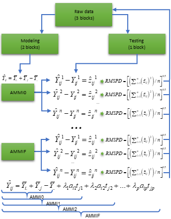
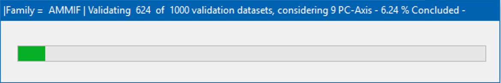
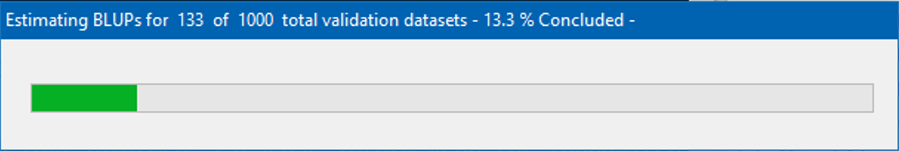

# Getting started
A dataset called `data_ge` is provided to make reproducible examples. For more information, please, see `?data_ge`. Other data sets can be used provided that the following columns are in the dataset: environment, genotype, block/replicate and response variable(s).

<style>
  .col2 {
    columns: 2 200px;         /* number of columns and width in pixels*/
    -webkit-columns: 2 200px; /* chrome, safari */
    -moz-columns: 2 200px;    /* firefox */
  }
  .col3 {
    columns: 3 100px;
    -webkit-columns: 3 100px;
    -moz-columns: 3 100px;
  }
</style>

```{r warning = FALSE, message = FALSE}
# Importing data
library(metan)
library(cowplot) # used to arrange the graphics
library(kableExtra) # Used to make the tables
# Function to make HTML tables
print_table = function(table){
  kable(table, "html", digits = 3) %>%
    kable_styling(bootstrap_options = c("striped", "hover", "condensed", "responsive"),
                  font_size = 12)
}
```


# Predictive accuracy 

<div class="col2">
The predictive accucary of both AMMI and BLUP models may be obtained using a cross-validation procedure implemented by the functions `cv_ammif()` and `cv_blup()` The `cv_ammif()` function provides a complete cross-validation procedure for all member of AMMI model family (AMMI0-AMMIF) using replicate-based data, according to the diagram below. Automatically the first validation is carried out considering the AMMIF (all possible axis used). Considering this model, the original data set is split up into two sets: training set and validation set.



The training set has all combinations (genotype x environment) with the number of replications informed in `nrepval` argument. The validation set has one replication that were not included in the training set. The splitting of the data set into training and validation sets depends on the design considered. For a Randomized Complete Block Design (default option) and the procedure we used in the article, completely blocks are randomly selected within environments, as suggested by @Piepho:1994. The remaining block serves as validation data. If `design = "CRD"` is informed, thus declaring that a completely randomized design was used, single observations are randomized for each treatment (genotype-by-environment combination). This is the same procedure suggested by @Gauch:1988. The estimated values for each member of the AMMI model family in each re-sampling cycle are compared with the observed values in the validation data. Then, the Root Mean Square Prediction Difference is computed as follows:

$$
   RMSPD = 
   {\left[ {\left( {\sum\nolimits_{i = 1}^n {{{\left( {{{\hat y}_{ij}} - {y_{ij}}} \right)}^2}} } \right)/n} \right]^{0.5}}
$$

where $\widehat{y}_{ij}$ is the model predicted value; and $y_{ij}$ is the observed value in the validation set. The number of random selection of blocks/replicates (*n*) is defined in the argument `nboot`. At the end of the *n* cycles for all models, a list with all estimated RMSPD and the average of RMSPD is returned.

</div>

The function  `cv_blup` provides a cross-validation of replicate-based data using mixed models. By default, complete blocks are randomly selected for each environment. The following code computes the cross-validation of the oat data using both AMMI and BLUP models. To avoid extensive processing time,  I will use 50 re-sampling procedures only. I suggest using a larger number, say, 1000.

```{r eval = TRUE, fig.height = 5, fig.width = 10, fig.align = "center" }
# cross-validation for AMMI model (declaring the number of axes)
AMMI0 = cv_ammi(data_ge, ENV, GEN, REP, GY, naxis = 0, nboot = 50, nrepval = 2)
AMMI2 = cv_ammi(data_ge, ENV, GEN, REP, GY, naxis = 2, nboot = 50, nrepval = 2)
AMMI9 = cv_ammi(data_ge, ENV, GEN, REP, GY, naxis = 9, nboot = 50, nrepval = 2)
# cross-validation for AMMI model (AMMI0-AMMIF)
AMMIF = cv_ammif(data_ge, ENV, GEN, REP, GY, nboot = 50, nrepval = 2)
# cross-validation for BLUP prediction
BLUP = cv_blup(data_ge, ENV, GEN, REP, GY, nboot = 50, nrepval = 2)


    ```

A progress bar is shown by default (the examples are below). Thus, it is possible to verify the status of the cross-validation process. If necessary, the progress bar can be disabled by informing the argument `progbar = FALSE` in the function.





## Printing the means of RMSPD estimates

All outputs shown in tables were laid out using the R package kableExtra. The pdf file of this package can be found [here](https://haozhu233.github.io/kableExtra/awesome_table_in_pdf.pdf).

```{r }
bind_mod = bind_cv(AMMIF, BLUP, bind = "means")
print_table(bind_mod$RMSPD)

    ```

The table above showns the descriptive statistics (mean, standard deviation, standar error of the mean, and quantiles 2.5% and 97.5%) of the 50 RMSPD estimates for each model, and are presented from the most accurate model (smallest RMSPD mean) to the least accurate model (highest RMSPD mean). 

## Plotting the RMSPD values

The values of the RMSPD estimates obtained in the cross-validation process may be plotted using the function`plot()`. 
```{r eval = TRUE, fig.height = 5, fig.width = 10, fig.align = "center", message = F, warning = F}
bind1 = bind_cv(AMMI0, AMMI2, AMMI9)
bind2 = bind_cv(AMMIF, BLUP)
p1 = plot(bind1, violin = TRUE)
p2 = plot(bind2, width.boxplot = 0.6, col.boxplot = "transparent")
plot_grid(p1, p2)
    ```

Six statistics are shown in this boxplot. The mean (black rhombus), the median (black line), the lower and upper hinges that correspond sto the first and third quartiles (the 25th and 75th percentiles, respectively). The upper whisker extends from the hinge to the largest value no further than $1.5\times{IQR}$ from the hinge (where IQR is the inter-quartile range). The lower whisker extends from the hinge to the smallest value at most $1.5\times{IQR}$ of the hinge. Data beyond the end of the whiskers are considered outlying points. If the condition `violin = TRUE`, a violin plot is added along with the boxplot. A violin plot is a compact display of a continuous distribution displayed in the same way as a boxplot.

# References

